<div align="center">


# Wordle Arena

**A multiplayer daily word-game platform.** Play Wordle, Spelling Bee and Connections, climb the
leaderboard, or race a live 1v1 **Arena** duel on the same word and clock — all with optional
accounts, Google sign-in and a full admin dashboard.

[](https://nextjs.org)
[](https://react.dev)
[](https://www.typescriptlang.org)
[](https://tailwindcss.com)
[](https://www.prisma.io)
[](https://www.postgresql.org)
[](#testing)
[](#testing)
[](https://xtreme-wordle.vercel.app)

**[Live demo →](https://xtreme-wordle.vercel.app)** · [Admin dashboard](https://xtreme-wordle.vercel.app/admin)

</div>

---

## Table of contents

1. [What it is](#what-it-is)
2. [Feature tour](#feature-tour)
3. [Screenshots](#screenshots)
4. [Tech stack](#tech-stack)
5. [Architecture](#architecture)
6. [System design](#system-design)
7. [Data model](#data-model)
8. [Project structure](#project-structure)
9. [Getting started](#getting-started)
10. [Environment variables](#environment-variables)
11. [Scripts](#scripts)
12. [Testing](#testing)
13. [Deployment](#deployment)
14. [Operations & security](#operations--security)
15. [API reference](#api-reference)
16. [How it was built](#how-it-was-built)
17. [Roadmap](#roadmap)

---

## What it is

Wordle Arena is a production-style, full-stack word-game platform built on **Next.js 16 (App
Router)**, **Prisma 7 / PostgreSQL**, and **Tailwind CSS v4**. It ships three classic daily puzzles
plus a real-time **1v1 duel mode**, an optional account system (email + Google), a pluggable email
pipeline, and an admin dashboard with analytics and scheduling.

Design goals:

- **Playable without an account.** Guests get a signed anonymous session; signing in is what unlocks
  history, stats and rank.
- **Worker-free realtime.** Arena match state is derived from timestamps, so no background worker or
  websocket server is required — it runs happily on serverless.
- **Secrets never leak.** The answer never reaches the browser before a game ends; every guess is
  validated and scored on the server.
- **Cheap to run.** One Next.js deployment + one Postgres database + free-tier services.

## Feature tour

### Games

- **Wordle** — daily (locked per IST day, resumes on reload) and unlimited (fresh word from a
  12-hourly pool snapshot), colour feedback, on-screen keyboard, spoiler-free share, recent stats.
- **Spelling Bee** — seven-letter honeycomb, words must include the centre letter, pangram bonus,
  score/progress against the full answer set (computed in SQL with a regex match).
- **Connections** — 16 words, four hidden groups, four mistakes allowed, deterministic shuffle.
- **Wordle Arena** — the headline mode (see [System design](#system-design)).

### Accounts & identity

- Email + password (bcrypt), opaque session tokens hashed with SHA-256 and delivered in an HTTP-only
  cookie.
- **Google sign-in** (OAuth 2.0 + PKCE); existing email accounts are linked on first Google sign-in.
- **Guest mode** with a signed anonymous cookie, and **guest → account migration** of progress.
- **Forgot password**: email → 6-digit OTP (hashed, 10-min expiry, 5 attempts) → signed reset ticket
  → new password + captcha. All sessions are revoked on reset, and the endpoint never reveals
  whether an address is registered.

### Profiles, avatars & leagues

- Parametric **faux-3D SVG avatars** — 12 categories, 150+ combinations, idle breath and blink,
  deterministic for guests/bots.
- Leagues **Bronze → Silver → Gold → Platinum → Diamond** at 0/200/500/1000/2000 points, with a
  public profile and a ranked leaderboard.

### Admin dashboard

Overview KPIs, users (search, ban, revoke sessions, reset password), games (toggle + edit), word
schedule, word lists with CSV import, analytics (14-day chart), an audit log of every admin
mutation, and a live arena match table.

### Platform

Dark-wood "liquid glass" theme with no-flash light/dark switching, cookie consent, SEO
(`robots.txt`, dynamic `sitemap.xml`, JSON-LD, OG metadata), accessibility (axe-checked WCAG 2.1
A/AA), custom app icons, rate limiting, and security headers.

## Screenshots

> Captured from the live production site (dark theme).

| Landing                                     | All games                               |
| ------------------------------------------- | --------------------------------------- |
| 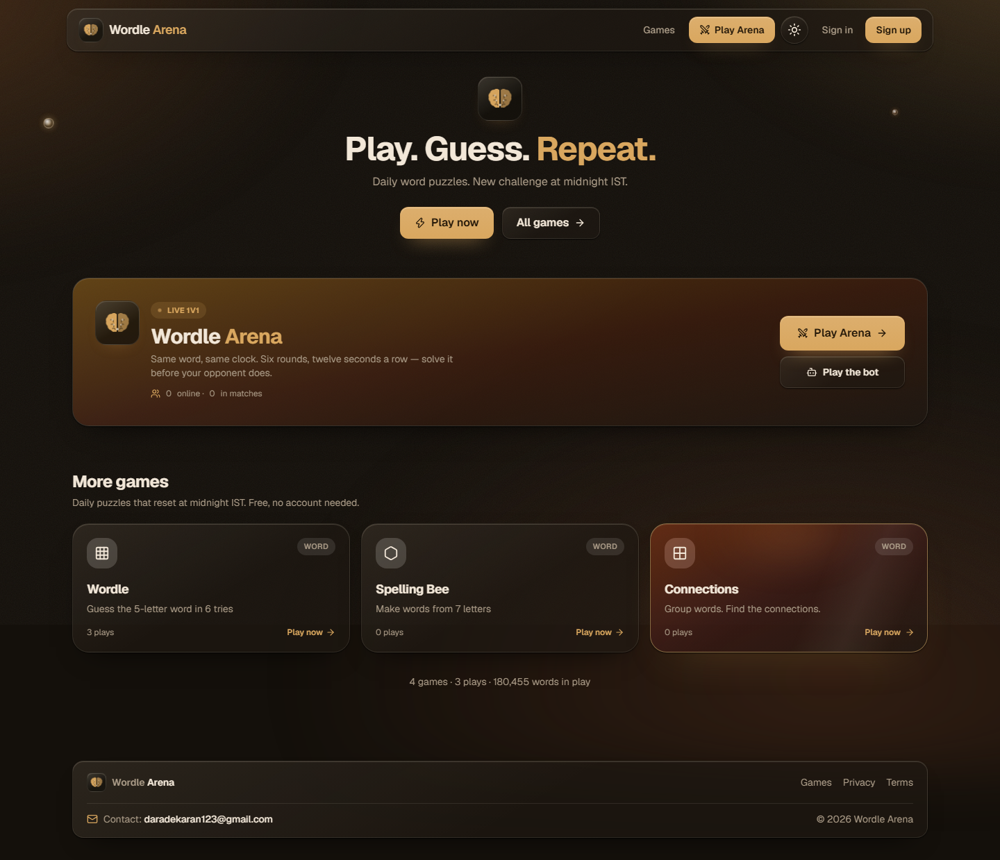 | 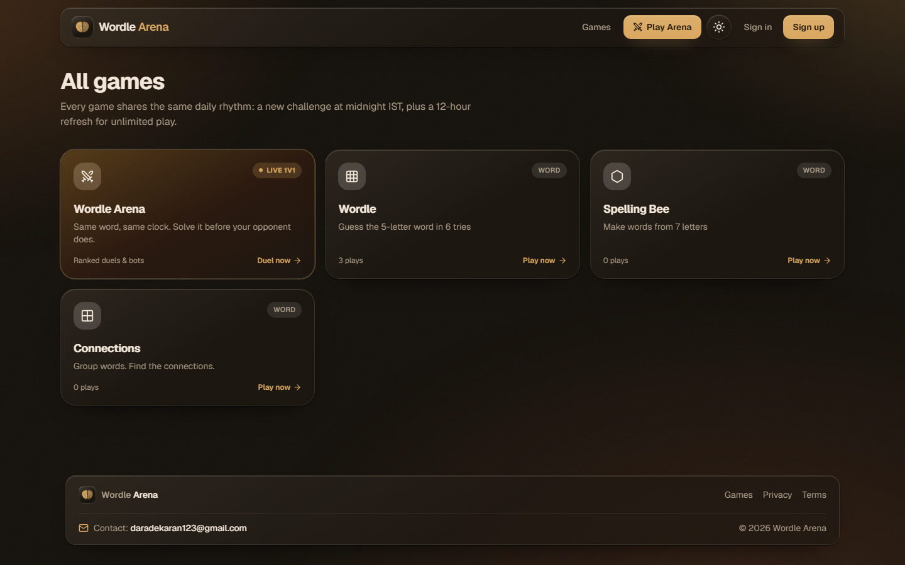 |

| Wordle                                    | Arena lobby                             |
| ----------------------------------------- | --------------------------------------- |
| 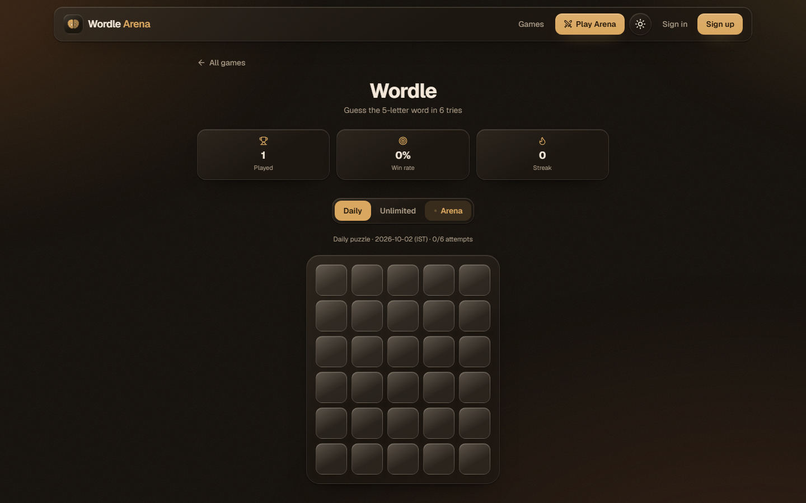 | 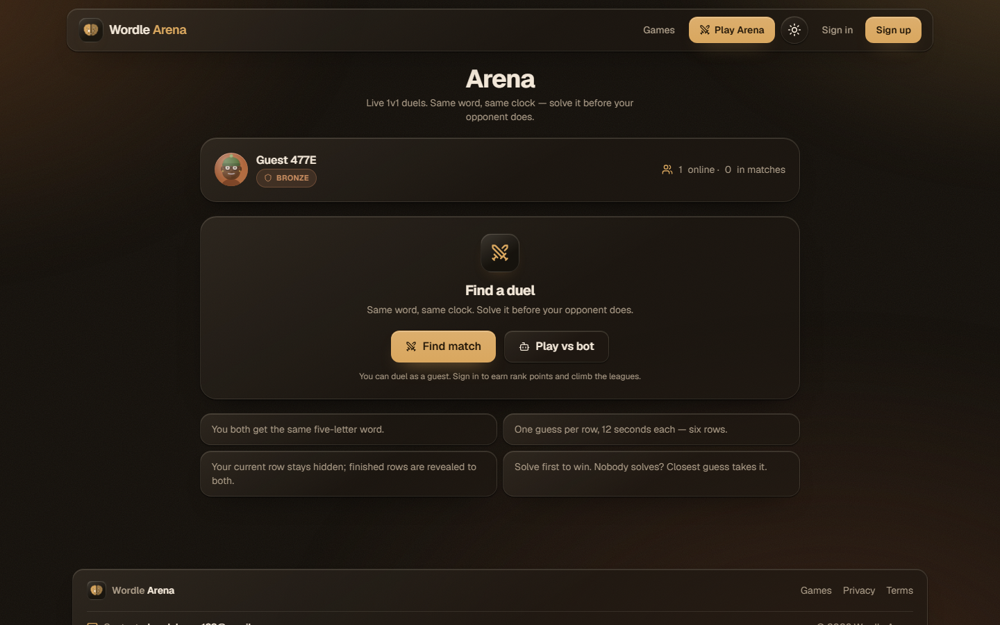 |

| Leaderboard                                         | Sign in                                    |
| --------------------------------------------------- | ------------------------------------------ |
| 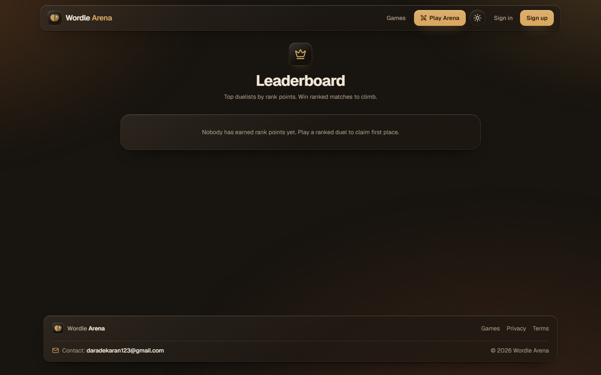 | 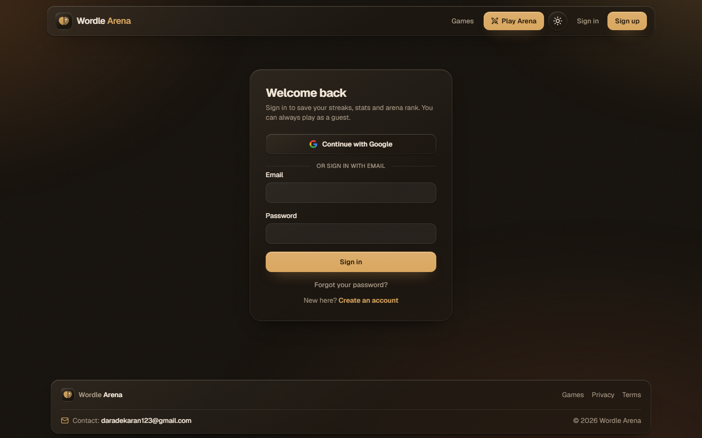 |

| Password reset                                              | 404                                             |
| ----------------------------------------------------------- | ----------------------------------------------- |
| 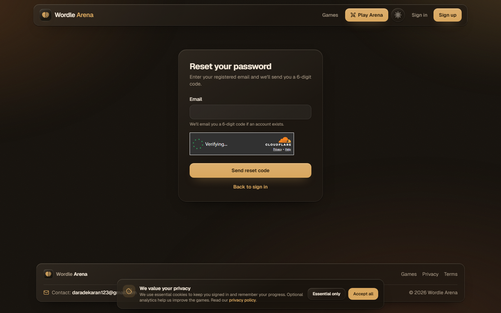 | 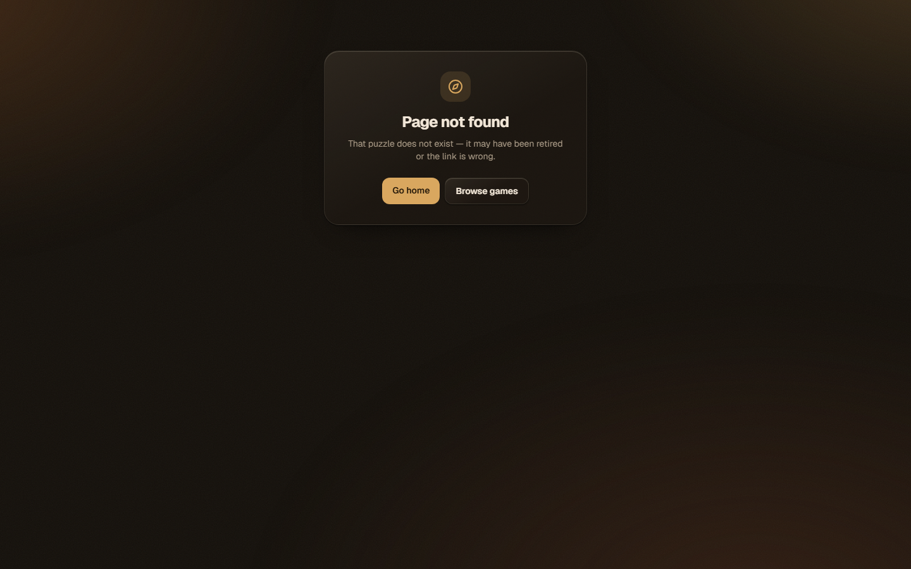 |

## Tech stack

| Layer     | Choice                                                            | Why                                                                             |
| --------- | ----------------------------------------------------------------- | ------------------------------------------------------------------------------- |
| Framework | **Next.js 16.3.8** (App Router, Turbopack, React 19)              | Server Components, Server Actions, Route Handlers and streaming in one runtime. |
| Language  | **TypeScript 5** (strict)                                         | End-to-end type safety from Prisma to React.                                    |
| Styling   | **Tailwind CSS v4** + design tokens in `globals.css`              | A single dark-wood "glass" system for light and dark.                           |
| Database  | **PostgreSQL 18** (Neon)                                          | Managed, serverless-friendly, pooled connections.                               |
| ORM       | **Prisma 7** + `@prisma/adapter-pg`                               | Typed client, migrations, driver adapter for `pg`.                              |
| Auth      | Opaque sessions (SHA-256) + bcrypt + **Google OAuth 2.0 / PKCE**  | No third-party auth lock-in; safe server-side sessions.                         |
| Captcha   | **Cloudflare Turnstile**                                          | Privacy-friendly, auto-bypassed in dev when unconfigured.                       |
| Email     | **Resend** or **Gmail SMTP** (pluggable)                          | Works with or without an owned domain.                                          |
| Realtime  | **Adaptive polling**                                              | No websockets/workers; serverless-friendly.                                     |
| Tests     | **Vitest** + **Playwright** + **axe-core**                        | Logic/DB unit + integration, real-browser E2E and a11y.                         |
| Quality   | ESLint 9, Prettier 3, `tsc --noEmit`                              | Enforced by `npm run verify`.                                                   |
| Hosting   | **Vercel** (region `sin1`) + **Vercel Cron** + **GitHub Actions** | Zero-config deploys, scheduled jobs, uptime checks.                             |

## Architecture

High-level view — one Next.js deployment talks to one Postgres database and a few external
services:

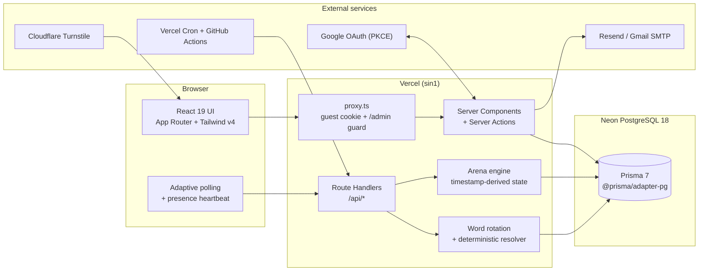

**Request lifecycle.** `proxy.ts` (Next 16's renamed middleware) runs on every non-asset request to
issue the anonymous guest cookie and optimistically redirect unauthenticated `/admin` visits. Real
authorisation happens in the Data Access Layer (`src/lib/auth/dal.ts`). Pages render as Server
Components; mutations use Server Actions; the games and arena use JSON Route Handlers `guardRequest`ed
by an origin check and per-IP rate limits.

## System design

### Arena — a worker-free realtime duel

Two players get the same word and race it out over six rounds of _play_ + _reveal_. Match state is
**derived from timestamps** (`src/lib/arena/clock.ts`): the round and phase are computed from
`startedAt` plus the configured durations, so any request — even one arriving after a crash — can
reconstruct exactly where the match is. Bots advance lazily on each state read, and guesses are
idempotent via a `(playerId, round)` unique constraint.

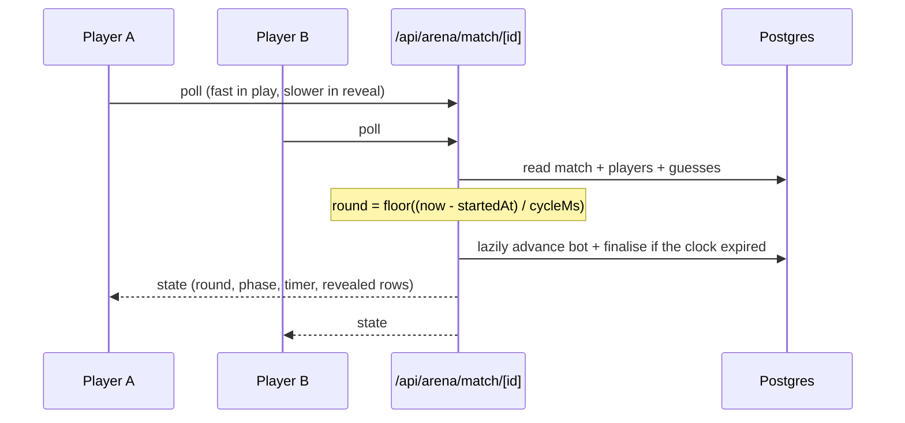

Scoring: solve first to win; otherwise the **closest** guess takes it (most greens, then most
yellows, then earliest submission); a true tie is a draw. Points only move when both players are
signed in; `30 × league multiplier` for a win plus an early-solve bonus, `−10` for a loss, `+10` for
a draw, never below zero.

### Word rotation

Every game has a **rotation bucket** computed in IST (`Asia/Kolkata`): `daily` → `YYYY-MM-DD`,
`twelve-hour` → `…-00` / `…-12`. Two mechanisms guarantee a word always exists:

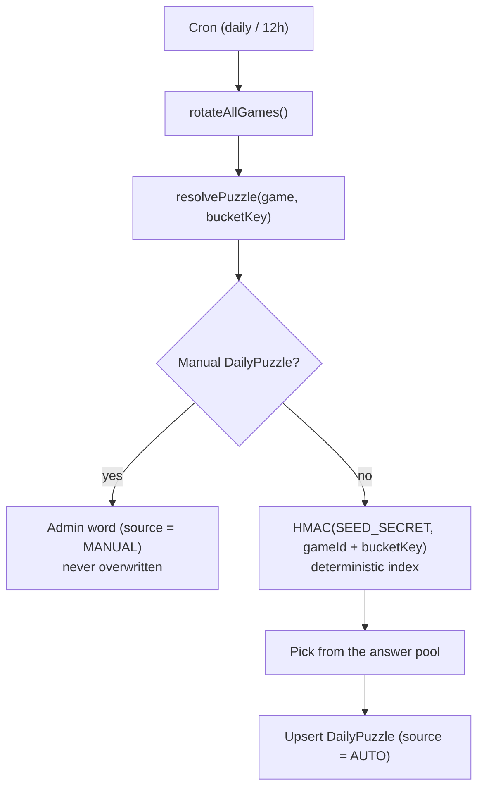

Because answers are deterministic, a missed scheduler run degrades nothing — it only means the row
is materialised later. Wordle **Unlimited** additionally draws from a per-12-hour `PoolRotation`
snapshot so a fresh set of words appears across the day.

### Password reset

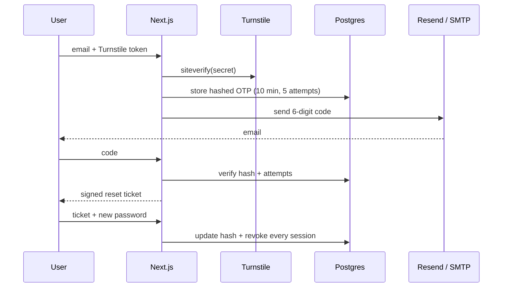

## Data model

19 Prisma models cover identity, content, games and the arena:

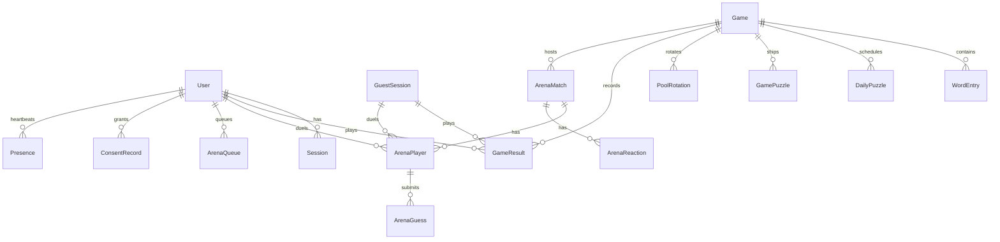

Key entities:

- **User / Session / GuestSession** — accounts, hashed sessions, anonymous guests.
- **Game / WordEntry / GamePuzzle / DailyPuzzle / PoolRotation** — game definitions, word pools,
  scheduled puzzles and 12-hour pool snapshots.
- **GameResult** — a player's board + outcome for a game/bucket.
- **ArenaMatch / ArenaPlayer / ArenaGuess / ArenaReaction / ArenaQueue** — duels.
- **PasswordResetOtp / ConsentRecord / SiteSetting / AdminAuditLog / Presence** — security, consent,
  configuration, auditing and the online counter.

## Project structure

```
src/
├─ app/
│  ├─ (site)/                 # public site (shared layout: header/footer)
│  │  ├─ page.tsx             # landing
│  │  ├─ games/               # hub, wordle, spelling-bee, connections, [slug]
│  │  ├─ arena/               # lobby + match/[id]
│  │  ├─ leaderboard/  profile/  profile/avatar/  u/[username]/
│  │  ├─ login/  signup/  forgot-password/  forgot-password/verify/  reset-password/
│  │  └─ privacy/  terms/
│  ├─ admin/                  # admin/login + (dashboard) users|games|arena|schedule|words|analytics|audit
│  ├─ api/                    # games, arena, auth/google, cron, health, presence
│  ├─ layout.tsx  icon.svg  favicon.ico  apple-icon.png  sitemap.ts  robots.ts  not-found.tsx
├─ components/                # ui, games, arena, admin, profile, auth, avatar, brand, theme
├─ lib/
│  ├─ games/                  # wordle, bee, connections, catalog, public queries
│  ├─ arena/                  # clock, engine, bot, cleanup, config, view, replay, presence
│  ├─ words/                  # resolver, rotation, feedback, random
│  ├─ auth/                   # actions, dal, session, otp, password-reset, google
│  ├─ admin/  profile/  avatar/  captcha/  mail/  http/  time/  env.ts
│  └─ db.ts  prisma.ts
├─ proxy.ts                   # Next 16 middleware (guest cookie + /admin guard)
prisma/
├─ schema.prisma  migrations/  seed.ts  data/   # word lists + connections puzzles
tests/
├─ unit/  integration/  e2e/  # Vitest + Playwright (+ axe)
```

## Getting started

**Prerequisites:** Node **22.x**, npm, and a PostgreSQL database (local or Neon).

```bash
# 1. Install dependencies (runs `prisma generate` via postinstall)
npm install

# 2. Configure the environment
cp .env.example .env
#   - set DATABASE_URL (and TEST_DATABASE_URL for the test suite)
#   - generate secrets:
node -e "console.log(require('crypto').randomBytes(32).toString('base64url'))"   # run 3x for SESSION_SECRET, SEED_SECRET, CRON_SECRET

# 3. Create the schema and seed admin, games, word lists and puzzles
npm run db:migrate
npm run db:seed

# 4. Start the dev server
npm run dev
```

- Site: <http://localhost:3000>
- Admin: <http://localhost:3000/admin> (sign in with `ADMIN_EMAIL` / `ADMIN_PASSWORD`)

`npm run db:seed` is idempotent (upserts). It imports ~2,300 Wordle answers, ~167k Bee words and
the Connections puzzles. Demo accounts are **opt-in** via `SEED_DEMO_USERS=1` and must never be
enabled on a production database.

## Environment variables

| Variable                                                                         | Purpose                                                                |
| -------------------------------------------------------------------------------- | ---------------------------------------------------------------------- |
| `DATABASE_URL`                                                                   | PostgreSQL connection string (use a **pooled** URL in serverless).     |
| `TEST_DATABASE_URL`                                                              | Separate database used by the test suite (never set in production).    |
| `SESSION_SECRET`                                                                 | Signs session/OTP material. **Required in production** (fails closed). |
| `SEED_SECRET`                                                                    | Deterministic word rotation/fallback. **Required in production.**      |
| `CRON_SECRET`                                                                    | Auth for `/api/cron/*` (`Authorization: Bearer` or `?secret=`).        |
| `ADMIN_EMAIL` / `ADMIN_PASSWORD` / `ADMIN_NAME`                                  | Bootstraps the admin during seeding.                                   |
| `NEXT_PUBLIC_SITE_URL`                                                           | Public base URL used for SEO/`metadataBase` (build-time).              |
| `GOOGLE_CLIENT_ID` / `GOOGLE_CLIENT_SECRET` / `GOOGLE_REDIRECT_URI`              | Google sign-in (hidden when unset).                                    |
| `MAIL_PROVIDER`                                                                  | `console` \| `file` \| `resend` \| `smtp`.                             |
| `MAIL_FROM` / `RESEND_API_KEY`                                                   | Resend delivery.                                                       |
| `SMTP_HOST` / `SMTP_PORT` / `SMTP_USER` / `SMTP_PASSWORD`                        | SMTP delivery (e.g. Gmail + App Password).                             |
| `NEXT_PUBLIC_TURNSTILE_SITE_KEY` / `TURNSTILE_SECRET_KEY`                        | Cloudflare Turnstile (bypassed when unset).                            |
| `AUTH_RATE_LIMIT`, `RESET_REQUESTS_PER_*`                                        | Rate-limit tuning.                                                     |
| `ARENA_ROUND_MS` / `ARENA_BREAK_MS` / `ARENA_COUNTDOWN_MS` / `ARENA_ROUND_COUNT` | Arena timings (defaults 12s / 5s / 3s / 6).                            |
| `SEED_DEMO_USERS`                                                                | `1` to create demo accounts (dev only).                                |

See `.env.example` for the full annotated list.

## Scripts

| Command                                                                   | What it does                                                |
| ------------------------------------------------------------------------- | ----------------------------------------------------------- |
| `npm run dev`                                                             | Start the dev server                                        |
| `npm run build` / `npm run start`                                         | Production build and serve                                  |
| `npm run verify`                                                          | Lint + typecheck + unit/integration tests                   |
| `npm run verify:full`                                                     | `verify` plus the complete Playwright suite                 |
| `npm run test:coverage`                                                   | Unit/integration tests with a coverage report for `src/lib` |
| `npm run test:e2e`                                                        | Fast Playwright run (skips `@heavy`; production build)      |
| `npm run test:e2e:full`                                                   | Every Playwright test, including `@heavy`                   |
| `npm run db:migrate` / `db:deploy` / `db:seed` / `db:reset` / `db:studio` | Prisma database tasks                                       |
| `npm run icons`                                                           | Regenerate app icons from `src/app/icon.svg`                |
| `npm run loadtest`                                                        | Probe the hot endpoints and report throughput/latency       |

## Testing

Two layers, each doing what it is good at:

- **Vitest** (`tests/unit`, `tests/integration`) — pure logic and database behaviour against a real
  PostgreSQL test database: rotation buckets, the word resolver, Wordle/Bee/Connections rules, cron
  auth, rate limiting, HTTP guards, validation and crypto helpers. **281 tests.**
- **Playwright** (`tests/e2e`) — the real UI against a production build: auth, the admin dashboard,
  all three games, guest→account migration, consent, SEO and automated
  [axe](https://github.com/dequelabs/axe-core) accessibility checks. **140 tests.** A global teardown
  deletes the `@example.com` accounts each run creates.

Tests tagged **`@heavy`** (theme/avatar/responsive sweeps, full reset and replay flows) are skipped
by `npm run test:e2e` and included by `npm run test:e2e:full`.

The Playwright config forces a deterministic environment via `webServer.env` — `MAIL_PROVIDER=file`,
relaxed rate limits, a **Turnstile bypass** (blank keys) and shortened arena timings — so the suite
is fast and offline even when real credentials are present.

## Deployment

A standard Next.js deployment; the only non-obvious parts are Prisma and a build-time database read.

1. Create a **pooled** PostgreSQL database (Neon/Supabase/Vercel Postgres) reachable from Vercel.
2. Add every variable from `.env.example` to the Vercel project (Production **and** Preview).
   `NEXT_PUBLIC_*` values are inlined at build time, so they must exist **before** the first build.
3. Apply the schema and seed once, against the direct (unpooled) URL:

   ```bash
   DATABASE_URL="<direct-url>" npx prisma migrate deploy
   DATABASE_URL="<direct-url>" npx prisma db seed
   ```

4. Deploy. `postinstall` runs `prisma generate` (the client under `src/generated` is not committed),
   and `vercel.json` registers the daily rotation and cleanup crons.
5. Point Google OAuth's redirect URI and the Turnstile widget hostname at the deployed domain.

Scheduling is split between **Vercel Cron** (daily rotate + cleanup) and **GitHub Actions**
(`.github/workflows/cron.yml` for a 12-hour refresh, `uptime.yml` for health checks). `/sitemap.xml`
is prerendered at build time, so the database must be reachable during `next build` (it falls back
to the static routes if the query fails).

## Operations & security

- **Sessions:** opaque tokens hashed with SHA-256 before storage, delivered in an HTTP-only,
  `SameSite=Lax` cookie that is `Secure` in production.
- **CSRF:** JSON game APIs reject cross-origin `Origin` headers; Server Actions rely on Next.js's
  origin checks.
- **Rate limiting:** credential attempts per IP + email, and per-IP limits on game and cron
  endpoints (in-process; swap `src/lib/http/rate-limit.ts` for Redis to share across instances).
- **Fail-closed secrets:** `SESSION_SECRET` and `SEED_SECRET` throw in production if unset rather
  than falling back to public development defaults.
- **Security headers:** `X-Content-Type-Options`, `X-Frame-Options`, `Referrer-Policy`,
  `Permissions-Policy` and `X-DNS-Prefetch-Control` on every route (`next.config.ts`).
- **Health check:** `GET /api/health` returns `200` when the app can reach PostgreSQL, `503`
  otherwise.
- **Auditing:** every admin mutation is written to the audit log.

## API reference

| Method     | Route                                                                 | Notes                                   |
| ---------- | --------------------------------------------------------------------- | --------------------------------------- |
| `GET`      | `/api/health`                                                         | DB-backed health probe.                 |
| `POST`     | `/api/games/wordle/start` · `/guess`                                  | Start/resume and submit a Wordle guess. |
| `POST`     | `/api/games/spelling-bee/start` · `/guess`                            | Bee puzzle and word submission.         |
| `POST`     | `/api/games/connections/start` · `/guess`                             | Connections board and group guesses.    |
| `GET/POST` | `/api/arena/queue`                                                    | Join/leave the duel queue.              |
| `GET`      | `/api/arena/match/[id]`                                               | Poll match state (drives the clock).    |
| `POST`     | `/api/arena/match/[id]/guess` · `/heartbeat` · `/leave` · `/reaction` | Duel actions.                           |
| `GET`      | `/api/auth/google/start` · `/callback`                                | OAuth 2.0 + PKCE handshake.             |
| `GET/POST` | `/api/cron/rotate-words` · `/cleanup`                                 | Secret-protected schedulers.            |
| `GET`      | `/api/presence`                                                       | Online counter heartbeat.               |

All JSON game routes are protected by an origin check and a per-IP rate limit.

## How it was built

The project was built in phases, each verified (`npm run verify`) before moving on:

| Phase                      | Scope                                                                                                               |
| -------------------------- | ------------------------------------------------------------------------------------------------------------------- |
| **P0 — Foundation**        | Next.js 16 + TypeScript + Tailwind v4, the dark-wood design system, Prisma schema, guest identity and health check. |
| **P1 — Wordle**            | Server-scored daily/unlimited Wordle with resume, share and stats.                                                  |
| **P2 — More games**        | Spelling Bee (SQL-derived answer set) and Connections (deterministic shuffle).                                      |
| **P3 — Accounts**          | Email auth, hashed sessions, DAL authorisation, guest→account migration.                                            |
| **P4 — Google OAuth**      | OAuth 2.0 with PKCE and verified-email account linking.                                                             |
| **P5 — Password reset**    | OTP + Turnstile + a pluggable mailer (console/file/Resend/SMTP) with signed reset tickets.                          |
| **P6 — Identity surfaces** | Faux-3D avatars, profiles, leagues and the leaderboard.                                                             |
| **P7 — Wordle Arena**      | Timestamp-derived duel engine, lazily-advanced bot, adaptive polling, reactions, replay and rematch.                |
| **P8 — Admin dashboard**   | Users, games, word schedule, word lists + CSV import, analytics, audit log and live arena.                          |
| **P9 — Harden & ship**     | Full test suites (Vitest + Playwright/axe), security headers, cron/cleanup, Vercel deploy, custom icons and CI.     |

## Roadmap

- Distributed rate limiting (Upstash Redis) for multi-instance correctness.
- Dynamic OG image and a PWA manifest.
- More Connections puzzles and richer Bee letter sets.
- Optional spectators and richer arena replay/animation.
- Verified sending domain (best deliverability) and richer email templates.

---

<div align="center">
Built with Next.js, Prisma and Tailwind — deployed on Vercel.
</div>
