# Wordle Arena — Technical Architecture

> Comprehensive technical architecture reference for the **Wordle Arena** codebase (repo folder: `Desi Wordle`, package name: `wordle-arena`).
>
> Every component, entity, flow, and diagram below is derived from the actual source tree (`src/`, `prisma/`, `tests/`, config files). Nothing speculative is included; where a feature is partially implemented or absent (e.g., no CI pipelines), that is stated explicitly.

**For a short newcomer-friendly summary, see [`docs/OVERVIEW.md`](./OVERVIEW.md).**

---

## 1. Project Overview

**Wordle Arena** is a multi-game daily word-puzzle website with a headline real-time **1v1 Arena duel** mode, an optional-accounts model (guest play first), and a full admin dashboard.

Core capabilities as implemented:

- **Solo daily games:** Wordle (daily + unlimited), Spelling Bee, Connections — all answers and feedback computed server-side.
- **Wordle Arena:** two players race the same word on a shared, timestamp-derived clock (6 rounds, 12s play + 5s reveal by default); bot opponent (`Byte` et al.) when no human is queued; rank points and Bronze→Diamond leagues for signed-in players.
- **Accounts (optional):** email/password (bcrypt) and Google OAuth 2.0 + PKCE; guest cookie identity that migrates to a user on sign-up/sign-in.
- **Password reset:** email OTP (hashed, 10-minute expiry, 5 attempts) + signed reset ticket cookie, protected by Cloudflare Turnstile.
- **Word rotation:** IST bucket keys with HMAC-deterministic daily-word resolution, cron pre-materialization, and manual admin overrides that always win.
- **Admin dashboard:** overview, users (ban/role), games, word schedule, word lists (CSV import), live arena, analytics, audit log.
- **Ops:** Vercel deployment with two cron endpoints, `/api/health` check, in-process rate limiting, security headers.

Deliberate constraints of the design (documented in code and README):

- **No WebSockets, no background workers, no Redis** — realtime behavior is polling + heartbeats + timestamp-derived state.
- **Answer secrecy:** the browser never receives the answer before a game ends.
- **Single deployable:** one Next.js app serving SSR pages, REST route handlers, and server actions against one PostgreSQL database.

---

## 2. Technology Stack

| Layer | Technology | Evidence |
|---|---|---|
| Framework | **Next.js 16.3.5** (App Router), React **19.2.8** | `package.json` |
| Language | TypeScript 5, `strict: true`, alias `@/* → ./src/*` | `tsconfig.json` |
| Edge/middleware | `src/proxy.ts` (Next 16 replacement for `middleware.ts`) | `src/proxy.ts` |
| Styling | **Tailwind CSS v4** (CSS-first config in `src/app/globals.css`, no `tailwind.config.*`), `clsx` + `tailwind-merge` (`cn()`), `next-themes`, `lucide-react` | `postcss.config.mjs`, `src/lib/utils.ts` |
| Database | **PostgreSQL** via **Prisma 7** (`@prisma/client`, `@prisma/adapter-pg` driver adapter) | `prisma/schema.prisma`, `src/lib/prisma.ts`, `src/lib/db.ts` |
| ORM client output | `src/generated/prisma` (git-ignored, generated) | `prisma/schema.prisma` |
| Auth | **Custom** (no auth library): bcryptjs (cost 12), opaque SHA-256-hashed session tokens, Google OAuth 2.0 + PKCE | `src/lib/auth/*` |
| Validation | `zod` | `src/lib/auth/validation.ts` |
| Email | Pluggable mailer: `console` / `file` / `resend` (Resend REST API) | `src/lib/mail/mailer.ts` |
| Captcha | Cloudflare Turnstile | `src/lib/captcha/turnstile.ts` |
| Testing | **Vitest** (unit + integration), **Playwright** (E2E + axe-core a11y) | `vitest.config.mts`, `playwright.config.ts` |
| Lint/format | ESLint 9 flat config (`eslint-config-next`), Prettier (+ Tailwind plugin) | `eslint.config.mjs`, `.prettierrc.json` |
| Hosting | **Vercel** (crons in `vercel.json`) + managed PostgreSQL | `vercel.json`, README production checklist |
| Not present | Redis/Upstash, WebSockets/SSE, message queues, GitHub Actions/other CI | repo-wide search |

---

## 3. System Architecture

### 3.1 Diagram: *Wordle Arena — System Context & Deployment Topology*

**What it represents:** The system boundary: browsers (guest or signed-in) and an admin operator talking to a single Next.js 16 application deployed on Vercel, which persists to PostgreSQL and integrates with three external services (Google, Cloudflare Turnstile, Resend). Scheduled work enters through Vercel Cron and an optional external 12-hour scheduler.

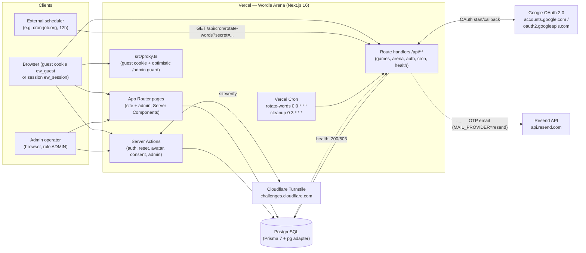

**Notes grounded in code:**

- There is exactly **one application process** (Next.js); there are no separate API servers, workers, or realtime gateways.
- Redis/Upstash does **not** exist anywhere; rate limiting and presence caching are in-process (`src/lib/http/rate-limit.ts`, `src/lib/arena/presence.ts`).
- Realtime is **HTTP polling + heartbeats** from client islands (`arena-stage.tsx`, `duel-board.tsx`), not sockets.

### 3.2 Diagram: *Wordle Arena — Core Data Flow (Guess Submission & View Response)*

**What it represents:** The end-to-end path of the hottest write in the system — a Wordle guess — from the client island’s `fetch`, through the shared HTTP guard and identity resolution, into domain validation and server-side feedback computation, persistence in `GameResult`, and assembly of the answer-free `WordleView` returned to the browser. The same pipeline shape applies to Connections/Bee guesses and Arena guesses (domain module and table differ).

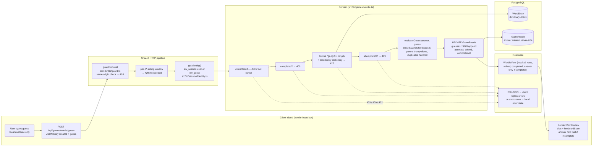

**Related write paths (same pattern):** Arena `submitArenaGuess` adds round/window checks (`roundForGuess`) and may call `finalizeMatch` on a solve; Server Action mutations (auth/admin) skip `guardRequest`’s game rate limit and use `authThrottle` / `requireAdmin` instead, then `revalidatePath` + `redirect` rather than JSON views.

---

## 4. Application Architecture

### 4.1 Diagram: *Wordle Arena — Application Component Architecture*

**What it represents:** The internal layering of the Next.js app: edge proxy → route groups (public site vs. admin dashboard) → data-access/domain modules in `src/lib` → Prisma/PostgreSQL, plus the split between Server Components, `"use client"` islands, REST route handlers, and Server Actions.

```mermaid
flowchart TB
    subgraph Edge["Edge (Next.js 16 proxy)"]
        PX["src/proxy.ts<br/>• bootstrap ew_guest cookie<br/>• optimistic /admin redirect"]
    end

    subgraph App["Next.js App Router (src/app)"]
        subgraph Site["Route group (site)"]
            PAGES["Pages: /, /games/*, /arena,<br/>/leaderboard, /profile, /u/[username],<br/>/login, /signup, /forgot-password*,<br/>/reset-password, /terms, /privacy"]
        end
        subgraph AdminG["Route group admin/(dashboard)"]
            APAGES["Pages: /admin, /users, /users/[id],<br/>/games, /arena, /schedule, /words,<br/>/analytics, /audit (+ /admin/login)"]
            ALAYOUT["layout.tsx → requireAdmin()"]
        end
        subgraph API["Route handlers (src/app/api)"]
            RH1["/api/games/{wordle,connections,spelling-bee}/{start,guess}"]
            RH2["/api/arena/queue, /api/arena/match/[id]*"]
            RH3["/api/auth/google/{start,callback}"]
            RH4["/api/cron/{rotate-words,cleanup}, /api/presence, /api/health"]
        end
    end

    subgraph Islands["Client islands (\"use client\")"]
        WB["wordle-board / connections-board / bee-board"]
        AS["arena-stage / duel-board / use-arena-sound"]
        AF["auth-form / password-reset-forms / turnstile-widget"]
        ADM["admin forms (schedule, import, users, games)"]
        UI["theme-toggle, cookie-banner, avatar-builder, admin-sidebar"]
    end

    subgraph Lib["Domain & data-access layer (src/lib)"]
        AUTH["auth/: actions, dal, session, tokens,<br/>password, throttle, otp, validation,<br/>google, google-signin, google-account,<br/>password-reset(+actions)"]
        GAMES["games/: wordle, wordle-view,<br/>connections, bee, catalog, public"]
        WORDS["words/: resolver, rotation,<br/>random, feedback"]
        ARENA["arena/: engine, clock, bot, guard,<br/>presence, cleanup, view, replay,<br/>config, admin"]
        HTTP["http/: guard, rate-limit, origin,<br/>json, safe-path"]
        SESS["session/: identity, guest, result"]
        ADMINL["admin/: actions, arena, queries,<br/>audit, types, url"]
        OTHER["mail/mailer, cron/auth,<br/>captcha/turnstile, consent/, avatar/,<br/>profile/, time/buckets, utils"]
    end

    subgraph Data["Persistence"]
        PRISMA["Prisma client<br/>(src/lib/db.ts, src/lib/prisma.ts)"]
        DB[("PostgreSQL<br/>19 models / 10 enums")]
    end

    PX --> App
    Site --> Lib
    AdminG --> Lib
    API --> Lib
    Islands -->|"fetch() JSON<br/>+ useActionState"| API
    Islands -->|"form actions"| Lib
    Lib --> PRISMA --> DB
    ALAYOUT -.->|"requireAdmin()"| AUTH
```

### 4.2 Structural rules observed in the codebase

1. **Server-first rendering.** Every page under `(site)` and `admin` is an async Server Component that reads data by importing `src/lib` modules directly (no HTTP hop for SSR data).
2. **Client islands** (~20 files with `"use client"`) own all interactivity: game boards, arena polling, forms (`useActionState`), theme toggle, cookie banner, admin sidebar/forms. They receive **serializable view objects** (`WordleView`, `ConnectionsView`, `BeeView`, `ArenaState`) as props or fetch them from `/api/**`.
3. **Two mutation planes:**
   - **REST route handlers** for hot loops (game starts/guesses, arena queue/match/presence) — called with relative `fetch()` from client islands.
   - **Server Actions** for form flows (auth, password reset, avatar save, consent, all admin mutations).
4. **No global state library** — only `next-themes` context; everything else is local `useState`/`useRef` plus wholesale replacement of the server-pushed view.
5. **`src/proxy.ts`** replaces middleware: guest cookie bootstrap + optimistic admin redirect only; matcher excludes `/api` and static assets. Real authorization lives in `src/lib/auth/dal.ts`.

### 4.3 Route inventory (as implemented)

**Public (`src/app/(site)`):** `/`, `/games`, `/games/wordle`, `/games/connections`, `/games/spelling-bee`, `/games/[slug]`, `/arena`, `/arena/match/[id]` (replay, `noindex`), `/leaderboard`, `/profile`, `/profile/avatar`, `/u/[username]`, `/login`, `/signup`, `/forgot-password`, `/forgot-password/verify`, `/reset-password`, `/terms`, `/privacy`.

**Admin (`src/app/admin`):** `/admin/login` (outside dashboard layout), `/admin`, `/admin/users`, `/admin/users/[id]`, `/admin/games`, `/admin/arena`, `/admin/schedule`, `/admin/words`, `/admin/analytics`, `/admin/audit`. Dashboard layout enforces `requireAdmin()`.

**Root:** `layout.tsx`, `error.tsx`, `not-found.tsx`, `sitemap.ts` (revalidate 3600), `robots.ts` (disallows `/admin`, `/api`).

---

## 5. Data Architecture

### 5.1 Diagram: *Wordle Arena — Entity Relationship Diagram*

**What it represents:** All **19 Prisma models** and **10 enums** in `prisma/schema.prisma`, with the relationships the application actually traverses (cascades and null-on-delete behavior summarized on key edges).

```mermaid
erDiagram
    User ||--o{ Session : "cascades"
    User ||--o{ GameResult : "userId SetNull"
    User ||--o{ AdminAuditLog : "adminId SetNull"
    User ||--o{ ConsentRecord : "userId SetNull"
    User ||--o{ DailyPuzzle : "createdByAdminId SetNull"
    User ||--o{ PoolRotation : "createdByAdminId SetNull"
    User ||--o{ ArenaPlayer : "userId SetNull"
    User ||--o{ ArenaQueue : "userId Cascade"
    User ||--o{ Presence : "userId Cascade"

    GuestSession ||--o{ GameResult : "guestId SetNull"
    GuestSession ||--o{ ConsentRecord : "guestId SetNull"
    GuestSession ||--o{ ArenaPlayer : "guestId SetNull"
    GuestSession ||--o{ ArenaQueue : "guestId Cascade"
    GuestSession ||--o{ Presence : "guestId Cascade"

    Game ||--o{ WordEntry : "gameId Cascade"
    Game ||--o{ GamePuzzle : "gameId Cascade"
    Game ||--o{ PoolRotation : "gameId Cascade"
    Game ||--o{ DailyPuzzle : "gameId Cascade"
    Game ||--o{ GameResult : "gameId Cascade"
    Game ||--o{ ArenaMatch : "gameId Cascade"

    DailyPuzzle ||--o{ GameResult : "puzzleId SetNull"

    ArenaMatch ||--|{ ArenaPlayer : "matchId Cascade"
    ArenaMatch ||--o{ ArenaGuess : "matchId Cascade"
    ArenaMatch ||--o{ ArenaReaction : "matchId Cascade"
    ArenaPlayer ||--o{ ArenaGuess : "playerId Cascade"
    ArenaMatch }o--o| ArenaMatch : "rematchOfId (nullable, unused by flows)"

    User {
        cuid id PK
        string email UK
        string username UK
        string passwordHash "nullable — Google-only accounts"
        string googleId UK "nullable"
        Role role "USER | ADMIN"
        boolean isBanned
        Json avatarConfig
        int rankPoints
        League league
        int wins losses draws matchesPlayed currentStreak bestStreak
    }
    Session {
        cuid id PK
        string tokenHash UK "SHA-256 of cookie token"
        datetime expiresAt
        datetime revokedAt
    }
    GuestSession {
        cuid id PK
        string token UK "ew_guest UUID"
        datetime lastSeenAt
        string convertedToUserId
    }
    PasswordResetOtp {
        cuid id PK
        string email
        string otpHash "HMAC-SHA256"
        int attempts
        datetime expiresAt
        datetime consumedAt
    }
    Game {
        cuid id PK
        string slug UK
        boolean isActive
        Json settings "resolver, rotation, answerLength, maxAttempts..."
    }
    WordEntry {
        cuid id PK
        string word
        string normalized
        boolean isAnswerPool
        boolean isActive
        string[] tags
    }
    GamePuzzle {
        cuid id PK
        string externalId
        Json payload "Connections groups / Bee letter sets"
    }
    PoolRotation {
        cuid id PK
        string bucketKey
        string seed "HMAC-derived"
    }
    DailyPuzzle {
        cuid id PK
        string bucketKey
        string word
        PuzzleSource source "AUTO | MANUAL"
    }
    GameResult {
        cuid id PK
        string userId
        string guestId
        GameMode mode "DAILY | UNLIMITED"
        string bucketKey
        string answer "server-side until completion"
        Json guesses
        boolean solved
        int attempts
    }
    ArenaMatch {
        cuid id PK
        ArenaMode mode "DUEL"
        ArenaMatchStatus status "PLAYING | FINISHED | ABANDONED"
        string word
        int roundCount roundMs breakMs countdownMs
        datetime startedAt finishedAt
        string endReason "solved | closest | draw | forfeit"
        int version
        boolean isCasual isDraw
    }
    ArenaPlayer {
        cuid id PK
        int slot "1 | 2"
        boolean isBot
        League league
        int pointsBefore pointsAfter pointsDelta
        MatchResult result "WIN | LOSS | DRAW"
        int solvedRound bestGreens bestYellows
        datetime lastSeenAt
    }
    ArenaGuess {
        cuid id PK
        int round
        string guess
        Json feedback
        boolean correct
    }
    ArenaQueue {
        cuid id PK
        ArenaQueueStatus status "WAITING | MATCHED | CANCELLED"
        string matchId
        datetime lastSeenAt
    }
    ArenaReaction {
        cuid id PK
        string emoji
    }
    Presence {
        cuid id PK
        string key UK "u:{userId} | g:{guestId}"
        PresenceStatus status "BROWSING | IN_MATCH"
        datetime lastSeenAt
    }
    AdminAuditLog {
        cuid id PK
        string action
        string targetType targetId
        Json meta
    }
    ConsentRecord {
        cuid id PK
        ConsentType type
        boolean granted
    }
    SiteSetting {
        string key PK "arena.leagues | arena.points | arena.timings"
        Json value
    }
```

**Enums (10):** `Role`, `PuzzleSource`, `GameMode`, `ConsentType`, `League`, `ArenaMode`, `ArenaMatchStatus`, `ArenaQueueStatus`, `MatchResult`, `PresenceStatus`.

### 5.2 Migrations & seed

| Migration | Contents |
|---|---|
| `20260915111209_init` | Core enums + User/Session/GuestSession/Game/WordEntry/GamePuzzle/PoolRotation/DailyPuzzle/GameResult/AdminAuditLog/ConsentRecord/SiteSetting |
| `20260915125642_add_game_result_answer` | Adds `GameResult.answer` |
| `20260921143000_arena_foundation` | Arena enums/tables, PasswordResetOtp, Presence; User gains `username`, `googleId`, `avatarConfig`, league/rank/streak fields; `passwordHash` becomes nullable |

`prisma/seed.ts` (idempotent upserts): admin user (`ADMIN_EMAIL`/`ADMIN_PASSWORD`), demo users, the three games from `GAME_CATALOG`, Wordle answer+guess lists from text files, Spelling Bee dictionary + up to 200 letter-set puzzles, Connections puzzles from JSON, and `SiteSetting` rows (`arena.leagues`, `arena.points`, `arena.timings`).

### 5.3 Where state lives

| Concern | Store | Notes |
|---|---|---|
| Solo game boards | `GameResult.guesses` (JSON) in Postgres | Answer column exists but is stripped from `WordleView` until `completed` |
| Daily answer of record | `DailyPuzzle` (unique per `gameId+bucketKey`) | Materialized by `resolvePuzzle` or admin `assignManualPuzzle` |
| Unlimited answer pool snapshot | `PoolRotation` (12h buckets) | Seed stored for reproducibility |
| Arena match truth | `ArenaMatch` + `ArenaGuess` + `ArenaPlayer` | Phase/round derived from `startedAt` via `matchClock` (no phase column) |
| Presence / online counts | `Presence` rows (60s window) + 5s in-process cache | Heartbeat every 25s |
| Rate-limit counters | In-process `Map` (sliding window) | Documented Redis swap seam |
| Ephemeral UI input | Client `useState` in boards | Never the source of truth |
| Consent, sessions, OTPs, audit | `ConsentRecord`, `Session`, `PasswordResetOtp`, `AdminAuditLog` | — |

### 5.4 Word rotation & bucket keys (data pipeline)

- Buckets are computed in **IST (UTC+5:30, no DST)** by `src/lib/time/buckets.ts`: `dailyBucketKey()` → `YYYY-MM-DD` (rolls 00:00 IST); `twelveHourBucketKey()` → `YYYY-MMDD-00|12`.
- Deterministic index: `HMAC-SHA256(SEED_SECRET, "${gameId}:${bucketKey}")` → uint32 (`deterministicIndex` in `src/lib/words/resolver.ts`), indexing the alphabetically ordered answer pool or puzzle list.
- `resolvePuzzle` idempotently persists `DailyPuzzle`; concurrent creates race-resolve by re-read. Admin `MANUAL` rows are never overwritten unless forced regenerate.
- Cron `rotateAllGames()` pre-materializes **current + next** buckets for every active game — an optimization only; the site works if the scheduler never runs.

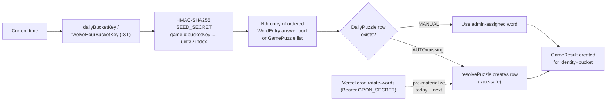

---

## 6. Authentication & Authorization

### 6.1 Diagram: *Wordle Arena — Session Authentication Flow*

**What it represents:** Email/password sign-up and sign-in through Server Actions: Zod validation → auth throttle → bcrypt verify/hash → opaque session token issued (only its SHA-256 hash stored) → `ew_session` HTTP-only cookie → guest results migrated to the user → redirect. Includes admin login divergence (role check + audit).

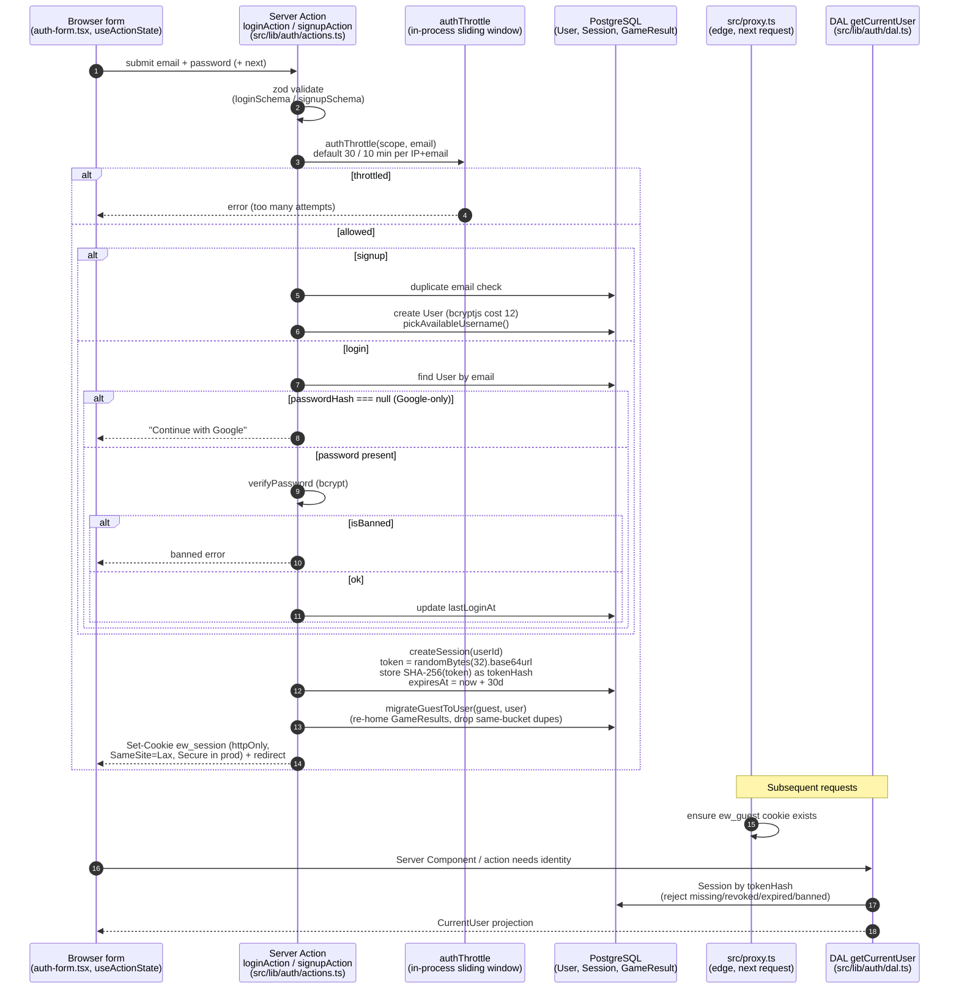

**Key facts:**

- Tokens are **opaque, not JWTs**. Cookie name: `ew_session` (`src/lib/auth/session.ts`, `constants.ts`).
- Guest identity: `ew_guest` UUID cookie set by `src/proxy.ts` (365-day TTL), lazily upserted as `GuestSession` in `src/lib/session/guest.ts`.
- Logout: `destroySession()` sets `revokedAt` and clears the cookie. Password reset calls `revokeAllSessions(userId)`.
- Google-only accounts cannot use password login (`passwordHash === null` check in `loginAction`).

### 6.2 Authorization model

| Layer | Mechanism | File |
|---|---|---|
| Edge (optimistic) | `/admin/*` without `SESSION_COOKIE` → `/admin/login?next=...` (presence check only) | `src/proxy.ts` |
| Data access layer (real) | `getCurrentUser()` (React `cache`-deduped), `requireUser()` redirect to login, `requireAdmin()` rejects `role !== "ADMIN"` | `src/lib/auth/dal.ts` |
| Admin surface | `requireAdmin()` in dashboard layout, individual admin pages, and **every** admin server action; no `/api/admin/*` HTTP routes exist | `src/app/admin/(dashboard)/layout.tsx`, `src/lib/admin/actions.ts` |
| Arena | `requireArenaIdentity()` per request (user or guest) | `src/lib/arena/guard.ts` |
| Game results | `ownsResult(result, identity)` ownership checks | `src/lib/session/result.ts` |
| Cron | `CRON_SECRET` via `Authorization: Bearer` or `?secret=`, SHA-256 + `timingSafeEqual` | `src/lib/cron/auth.ts` |
| Audit | `logAdminAction()` → `AdminAuditLog` on admin login and every mutation | `src/lib/admin/audit.ts` |

Roles: `Role` enum = `USER | ADMIN` (indexed on `User.role`). Admin bootstrap happens in `prisma/seed.ts` from `ADMIN_EMAIL`/`ADMIN_PASSWORD`.

---

## 7. Google OAuth

### 7.1 Diagram: *Wordle Arena — Google OAuth 2.0 + PKCE Sequence*

**What it represents:** The complete sign-in-with-Google flow as implemented: guarded start endpoint generates PKCE verifier/challenge + state (stored in short-lived cookies), browser is redirected to Google, callback validates state, exchanges the code with the verifier, fetches userinfo, then resolves the local account (existing Google user / link-by-email / brand-new Google-only user) and creates a session.

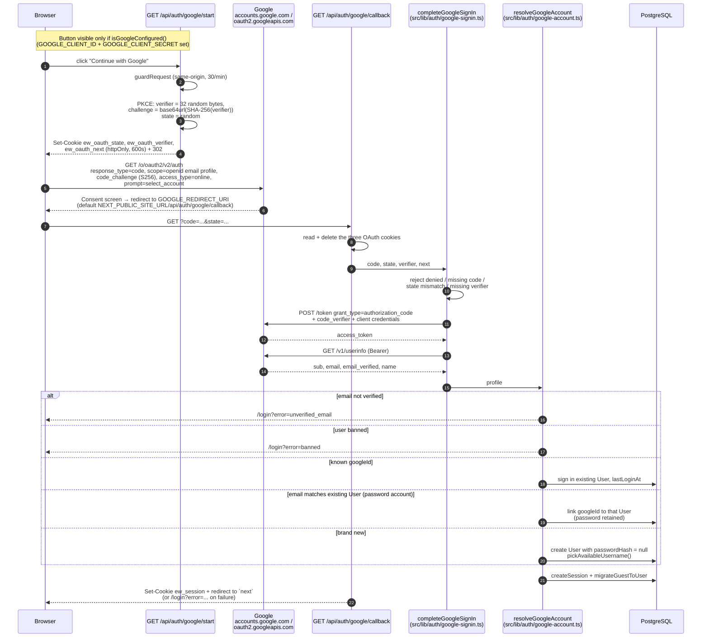

**Files:** `src/lib/auth/google.ts` (URLs/config), `google-signin.ts` (code exchange + profile fetch), `google-account.ts` (account resolution), routes `src/app/api/auth/google/start/route.ts` and `.../callback/route.ts`, UI `src/components/auth/google-button.tsx` (error map `OAUTH_MESSAGES`). Redirect URI: `GOOGLE_REDIRECT_URI` or `<NEXT_PUBLIC_SITE_URL>/api/auth/google/callback`.

---

## 8. Password Reset & Turnstile

### 8.1 Diagram: *Wordle Arena — Password Reset Flow (OTP + Signed Ticket)*

**What it represents:** The three-step reset: (1) request a 6-digit code — Turnstile + throttle + per-email/IP caps, anti-enumeration always-OK response, email via pluggable mailer; (2) verify the code — attempt counter, timing-safe HMAC compare, consumption, issuance of HMAC-signed `ew_reset_ticket` cookie; (3) set new password — Turnstile + ticket verification, bcrypt re-hash, revocation of all sessions, cleanup of OTPs.

```mermaid
sequenceDiagram
    autonumber
    participant U as Browser
    participant P1 as /forgot-password<br/>requestPasswordResetAction
    participant P2 as /forgot-password/verify<br/>verifyResetOtpAction
    participant P3 as /reset-password<br/>resetPasswordAction
    participant TS as Cloudflare Turnstile<br/>(server verifyTurnstile)
    participant DB as PostgreSQL<br/>(PasswordResetOtp, User, Session)
    participant M as Mailer<br/>(console | file | resend)

    Note over U,P1: Step 1 — request code
    U->>P1: email + captchaToken
    P1->>TS: siteverify (required when keys configured)
    P1->>P1: authThrottle("reset-request", email)
    P1->>DB: cap checks from PasswordResetOtp rows:<br/>≤ RESET_REQUESTS_PER_EMAIL_PER_HOUR (3)<br/>≤ RESET_REQUESTS_PER_IP_PER_HOUR (30) / hour
    P1->>DB: consume outstanding OTPs for email
    P1->>DB: otpHash = HMAC(SESSION_SECRET, "otp:"+code)<br/>expiresAt = now+10min, attempts = 0
    P1->>M: send 6-digit code email
    P1-->>U: always {ok:true} (anti-enumeration) +<br/>redirect /forgot-password/verify?email=...

    Note over U,P2: Step 2 — verify code
    U->>P2: email + code (+ resend action available)
    P2->>DB: latest unconsumed, unexpired OTP for email
    alt attempts >= 5
        P2-->>U: too many attempts
    else
        P2->>DB: attempts++ ; timingSafeEqual(HMAC(code))
        alt match
            P2->>DB: consumedAt = now
            P2->>P2: ticket = base64url(JSON{email,otpId,exp}).HMAC
            P2-->>U: Set-Cookie ew_reset_ticket (httpOnly, 600s) +<br/>redirect /reset-password
        else no match
            P2-->>U: invalid code error
        end
    end

    Note over U,P3: Step 3 — set new password
    U->>P3: password + confirm + captchaToken
    P3->>TS: siteverify
    P3->>P3: zod resetPasswordSchema
    P3->>P3: verifyResetTicket(ew_reset_ticket)<br/>(HMAC + exp)
    P3->>DB: update passwordHash (bcrypt 12), passwordUpdatedAt
    P3->>DB: revokeAllSessions(userId)
    P3->>DB: consume remaining OTPs for email
    P3-->>U: clear ticket cookie + redirect /login?reset=1
```

**Files:** `src/lib/auth/password-reset.ts` (core logic), `src/lib/auth/password-reset-actions.ts` (actions + `captchaOk()`), `src/lib/auth/otp.ts` (OTP/ticket crypto), forms `src/components/auth/password-reset-forms.tsx`, pages under `src/app/(site)/forgot-password*` and `reset-password`. Tests: `tests/unit/password-reset.test.ts`, `tests/integration/password-reset-flow.test.ts`, `tests/e2e/password-reset.spec.ts`.

### 8.2 Diagram: *Wordle Arena — Cloudflare Turnstile Verification Flow*

**What it represents:** Client widget rendering → hidden `captchaToken` input → server-side siteverify call, including the development bypass when secret keys are absent. Documents exactly where Turnstile is enforced: **password-reset request and final reset only** — not login, signup, or admin login (those rely on `authThrottle`).

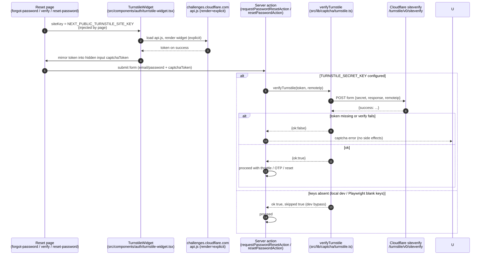

**Scope note (important):** server enforcement (`captchaOk()`) is wired into `requestPasswordResetAction` and `resetPasswordAction` in `src/lib/auth/password-reset-actions.ts`. The verify-OTP step renders the widget but does not enforce captcha server-side. Playwright blanks both Turnstile keys in `webServer.env` so E2E stays offline.

---

## 9. Wordle Game Architecture

### 9.1 Diagram: *Wordle Arena — Wordle Game Session Flow & Answer-Visibility State*

**What it represents:** The lifecycle of a single Wordle `GameResult` from identity resolution through start/resume, the server-validated guess loop, and terminal states — emphasizing that `answer` is only included in the client `WordleView` once the game is `completed`.

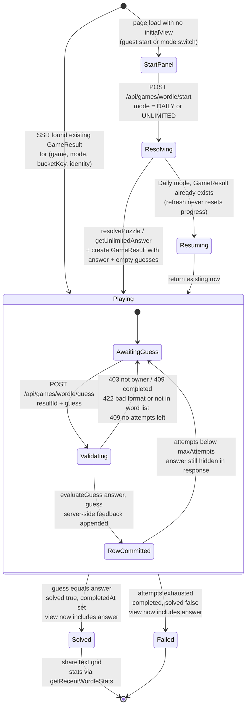

### 9.2 Core mechanics (implementation details)

| Concern | Implementation |
|---|---|
| Start/resume (Daily) | `startWordle`: bucket = `dailyBucketKey()` (IST); existing `GameResult` for identity+bucket is returned (refresh never resets); else `resolvePuzzle` + insert |
| Start (Unlimited) | Always new row; `getUnlimitedAnswer()` picks a random unused word from the 12-hour `PoolRotation` pool (excludes words already served in this bucket for `UNLIMITED` mode) |
| Guess validation chain | ownership → not completed → `^[a-z]+$` + correct `answerLength` → membership in `WordEntry` dictionary → attempts remaining |
| Feedback | `evaluateGuess` in `src/lib/words/feedback.ts` (two-pass greens-then-yellows with duplicate handling) runs **on the server**; response contains rows of `{word, feedback}` |
| Answer secrecy | `WordleView.answer` is `null` until `completed` (`src/lib/games/wordle-view.ts`) |
| Keyboard coloring | `keyboardState(rows)` ranks absent < present < correct |
| Sharing | `shareText()` → 🟩🟨⬜ grid via `navigator.clipboard` |
| Stats | `getRecentWordleStats`: last 20 DAILY results → played, solved, win rate, streak |

### 9.3 Sibling games (same architecture, different rules)

- **Connections** (`src/lib/games/connections.ts`): `GamePuzzle.payload` = 4 groups × 4 words; board words shuffled with `seededShuffle(bucketKey + firstCategory)` so all players see the same order; guess = exactly 4 distinct unsolved board words matched by sorted signature; `maxMistakes` default 4.
- **Spelling Bee** (`src/lib/games/bee.ts`): `GamePuzzle.payload` = `{centre, outer, pangram}`; dictionary fetched via Postgres regex with a 10-minute in-process word-list cache; scoring 4-letter = 1pt, else length, pangram +7.

All three store progress in the same `GameResult` table (`mode`, `bucketKey`, `guesses` JSON shape differs per game).

---

## 10. Arena / Multiplayer Architecture

### 10.1 Diagram: *Wordle Arena — Multiplayer Duel Lifecycle*

**What it represents:** The full 1v1 lifecycle: lobby → queue (or bot match) → transactional pairing → match phases derived purely from timestamps (`countdown → play ⇄ reveal × 6 → finished`) → outcome resolution (solve / closest / draw / forfeit) → transactional finalization with rank-point settlement. Shows every termination path, including cron cleanup and admin force-end.

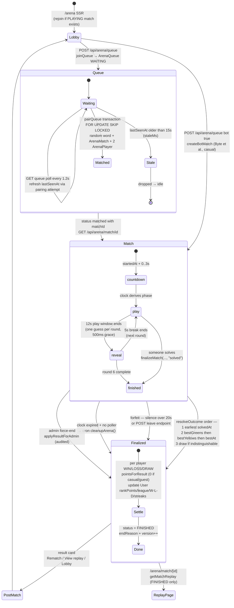

### 10.2 How it works (worker-free design)

**Matchmaking (`src/lib/arena/engine.ts`):**

1. `joinQueue` deletes prior self `WAITING` rows, inserts denormalized name/league row.
2. Client polls `GET /api/arena/queue` every **1.2s**; server `pairQueue` runs in one `prisma.$transaction` with raw SQL `FOR UPDATE SKIP LOCKED`: lock my row, claim the oldest **fresh** opponent (`lastSeenAt > now − 15s`), pick a random answer from the Wordle answer pool, create `ArenaMatch` (`PLAYING`, timings from `arenaTimings()`) + two `ArenaPlayer`s (capturing `pointsBefore`), mark both queue rows `MATCHED`.
3. `isCasual = !(both players signed in)` — guests never move rank points.
4. Bot path: `createBotMatch` creates a match immediately with an `isBot` slot (used when user opts in or after ~12s waiting via UI affordance).

**Clock (no workers) — `src/lib/arena/clock.ts`:**

- `matchClock(timing, now)` derives `{phase: countdown|play|reveal|finished, round, msRemaining, playEndsAt, roundEndsAt}` from `startedAt` + configured durations only. Any request (including after a crash) reconstructs the exact state.
- `roundForGuess(timing, now, graceMs=500)` accepts a guess if the play window is open, or if the request arrived within 500ms after expiry (in-flight grace).
- Client draws a smooth countdown locally using `serverNow − Date.now()` offset recalibrated on every poll.

**Guessing & reveal rules:**

- One guess per round enforced app-side + DB `@@unique([playerId, round])`.
- `evaluateGuess(match.word, guess)` stored as `ArenaGuess`; player `bestGreens/bestYellows/bestAt` updated monotonically; correct answer → immediate `finalizeMatch(..., "solved")`.
- `getArenaState` reveals **opponent rows only for past rounds** (or when `FINISHED`); the word is included only when `FINISHED`.

**Bots (`src/lib/arena/bot.ts`):** fully deterministic pure functions keyed by `(matchId, round)` — think delay, skill roll, and candidate pick — so `advanceBots` can lazily backfill elapsed rounds on any state read, idempotently, with backdated `receivedAt`. Difficulty scales by league (Bronze slower/less skill → Diamond faster/full skill). Names: Byte, Cortex, Synapse, Axon, Neuron.

**Outcome (`resolveOutcome`) — single source of truth** used by live end, cleanup cron, and admin force-end:

1. Earliest `solvedAt` wins (`endReason: "solved"`).
2. Else most `bestGreens`, then `bestYellows`, then earlier `bestAt` (`"closest"`).
3. Indistinguishable rows → draw (`"draw"`). Forfeit sets `"forfeit"`.

**Finalization:** one transaction → per-player `WIN/LOSS/DRAW`, `pointsForResult` (win 30, loss −10, draw 10 + round-solve bonus, × league multiplier 1–1.6; 0 for casual/guest), clamp `rankPoints ≥ 0`, update `User` league/record/streaks, match → `FINISHED` + `version++` (poll invalidation).

**Connectivity:**

| Signal | Interval | Purpose |
|---|---|---|
| Queue poll `GET /api/arena/queue` | 1.2s | pairing status |
| Match poll `GET /api/arena/match/[id]` | 0.9s (play) / 1.4s (reveal); stops when FINISHED | state + lazy bot advance + clock expiry finalize |
| Match heartbeat `POST .../heartbeat` | 5s | `ArenaPlayer.lastSeenAt` (opponent `connected` flag; 20s silence → forfeit) |
| Presence `POST /api/presence` | 25s | `Presence` row; online counts cached 5s (60s window) |
| Reaction throttle | client ≥1.5s / server 1.2s | emoji whitelist 😂😭😡🔥👏 |

**Config (`src/lib/arena/config.ts`):** defaults `roundCount 6`, `roundMs 12000`, `breakMs 5000`, `countdownMs 3000` — overridable via `ARENA_ROUND_COUNT/ROUND_MS/BREAK_MS/COUNTDOWN_MS` (Playwright shortens these). Leagues: Bronze 0 / Silver 200 / Gold 500 / Platinum 1000 / Diamond 2000 rank points. `SiteSetting` rows mirror leagues/points/timings for admin display.

**Cleanup cron (`src/lib/arena/cleanup.ts`, `GET|POST /api/cron/cleanup`):** finalize `PLAYING` matches past `totalMatchMs + 5s`; delete queue rows stale > 60s; delete `PasswordResetOtp` expired > 24h; prune `Presence` older than 1h. Also invoked opportunistically from the rotation cron and admin arena overview.

---

## 11. API Architecture

### 11.1 Diagram: *Wordle Arena — API Surface Architecture*

**What it represents:** The complete public HTTP surface (18 route handlers) grouped by domain, the separate Server-Action plane (forms/admin — intentionally **no** `/api/admin/*` routes), and the shared request pipeline (origin guard + rate limit → identity resolution → domain module → JSON).

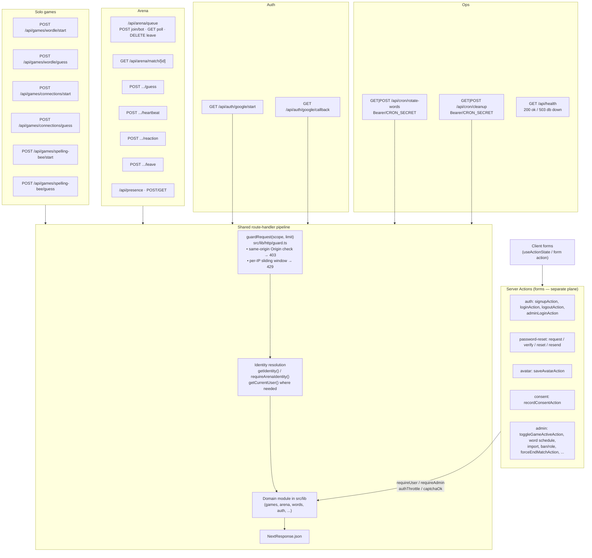

### 11.2 Complete route table

| Endpoint | Methods | Domain module | Rate limit (default) |
|---|---|---|---|
| `/api/health` | GET | Prisma connectivity | guard defaults |
| `/api/presence` | GET, POST | `arena/presence` | guard |
| `/api/auth/google/start` | GET | `auth/google` + PKCE cookies | 30/min |
| `/api/auth/google/callback` | GET | `google-signin` → `google-account` | guard |
| `/api/cron/rotate-words` | GET, POST | `words/rotation.rotateAllGames` + `cleanupArena` | `CRON_SECRET` |
| `/api/cron/cleanup` | GET, POST | `arena/cleanup.cleanupArena` | `CRON_SECRET` |
| `/api/arena/queue` | POST, GET, DELETE | `joinQueue` / `pairQueue` / `createBotMatch` / `leaveQueue` | 60 join / 240 poll |
| `/api/arena/match/[id]` | GET | `getArenaState` (lazy bots, clock finalize) | guard |
| `/api/arena/match/[id]/guess` | POST | `submitArenaGuess` | guard |
| `/api/arena/match/[id]/heartbeat` | POST | `heartbeat` + presence `IN_MATCH` | guard |
| `/api/arena/match/[id]/reaction` | POST | `sendReaction` (whitelist + 1.2s) | guard |
| `/api/arena/match/[id]/leave` | POST | `leaveMatch` (forfeit) + `leaveQueue` | guard |
| `/api/games/wordle/start` | POST | `startWordle` | guard |
| `/api/games/wordle/guess` | POST | `submitWordleGuess` | 120/min |
| `/api/games/connections/start` | POST | `startConnections` | guard |
| `/api/games/connections/guess` | POST | `submitConnectionsGuess` | guard |
| `/api/games/spelling-bee/start` | POST | `startBee` | guard |
| `/api/games/spelling-bee/guess` | POST | `submitBeeWord` | guard |

All handlers export `dynamic = "force-dynamic"`.

### 11.3 Server-Action plane

| File (`"use server"`) | Actions |
|---|---|
| `src/lib/auth/actions.ts` | `signupAction`, `loginAction`, `logoutAction` |
| `src/lib/auth/password-reset-actions.ts` | request / verify / reset / resend |
| `src/lib/avatar/actions.ts` | `saveAvatarAction` |
| `src/lib/consent/actions.ts` | `recordConsentAction` |
| `src/lib/admin/actions.ts` | game toggle, word schedule/import, user ban/role, etc. (all `requireAdmin()` + audit) |
| `src/lib/admin/arena.ts` | `forceEndMatchAction` |

---

## 12. Security Architecture

### 12.1 Diagram: *Wordle Arena — Security Architecture (Defense in Depth)*

**What it represents:** Layered controls from the edge to the database: proxy pre-checks, HTTP guards, credential throttles, captcha, cryptographic storage of secrets (session tokens, OTPs, tickets, cron secret, word-resolution seed), response-shaping (answer hiding), security headers, and audit logging.

```mermaid
flowchart TB
    subgraph L1["Layer 1 — Edge (src/proxy.ts + next.config.ts)"]
        PX1["Guest cookie bootstrap (no DB)"]
        PX2["Optimistic /admin redirect<br/>(session cookie presence only)"]
        HD["Security headers: X-Content-Type-Options,<br/>X-Frame-Options SAMEORIGIN, Referrer-Policy,<br/>Permissions-Policy, poweredByHeader=false"]
        MATH["Matcher excludes /api + static assets<br/>(APIs never pass through proxy)"]
    end

    subgraph L2["Layer 2 — Request pipeline (src/lib/http)"]
        OR["Origin check (guardRequest)<br/>cross-origin JSON → 403"]
        RL["In-process sliding-window rate limit<br/>(per-IP; auth: per-IP+email via authThrottle)"]
        JP["JSON body parsing helpers"]
    end

    subgraph L3["Layer 3 — Application gates"]
        DALG["DAL: getCurrentUser / requireUser / requireAdmin<br/>(real role enforcement)"]
        OWNG["ownsResult / requireArenaIdentity"]
        CAP["Cloudflare Turnstile<br/>(password-reset request + final step)"]
        CRONC["CRON_SECRET: SHA-256 + timingSafeEqual"]
    end

    subgraph L4["Layer 4 — Cryptography & storage"]
        SH["Session: opaque token, SHA-256 hash at rest<br/>ew_session httpOnly SameSite=Lax Secure(prod)"]
        BH["Passwords: bcryptjs cost 12"]
        OH["OTP: HMAC-SHA256(SESSION_SECRET) at rest,<br/>timing-safe compare, 10min / 5 attempts"]
        TK["Reset ticket: stateless HMAC-signed cookie<br/>ew_reset_ticket 10min"]
        SD["Word resolution seed: SEED_SECRET HMAC<br/>(not exposed to client)"]
    end

    subgraph L5["Layer 5 — Data exposure rules"]
        AH["Answer omitted from views until game completes<br/>(WordleView / ArenaState)"]
        REV["Arena: opponent current row hidden until round passes;<br/>word only when FINISHED"]
        SAFE["Safe projections: CurrentUser, ArenaState,<br/>WordleView (no Prisma objects to client)"]
        ROB["robots: /admin, /api disallowed;<br/>profile/replay pages noindex"]
    end

    subgraph L6["Layer 6 — Accountability"]
        AUD["AdminAuditLog on every admin mutation<br/>(src/lib/admin/audit.ts)"]
        HEAL["GET /api/health for uptime monitoring"]
    end

    L1 --> L2 --> L3 --> L4 --> L5 --> L6
```

**Additional notes:**

- CSRF: JSON game APIs reject cross-origin `Origin` headers (`src/lib/http/origin.ts` via `guardRequest`); Server Actions rely on Next.js built-in origin protection; all cookies are `SameSite=Lax`.
- Anti-enumeration: password-reset request always returns `{ok:true}`.
- Rate-limit single-instance caveat is documented in code (`src/lib/http/rate-limit.ts`): swap for Redis/Upstash before multi-instance deployment.
- `SEED_SECRET` / `SESSION_SECRET` / `CRON_SECRET` are distinct environment secrets; dev fallbacks exist only for local development and should be replaced in production (README production checklist).

---

## 13. Deployment Architecture

### 13.1 Diagram: *Wordle Arena — Production Deployment Architecture*

**What it represents:** The production topology as configured: Vercel hosting the Next.js build with two registered crons, a managed PostgreSQL database (migrations applied via `prisma migrate deploy`, seed idempotent), an optional external scheduler for the IST-aligned 12-hour rotation (Vercel Hobby allows only 1 cron/day), and the health endpoint for uptime checks.

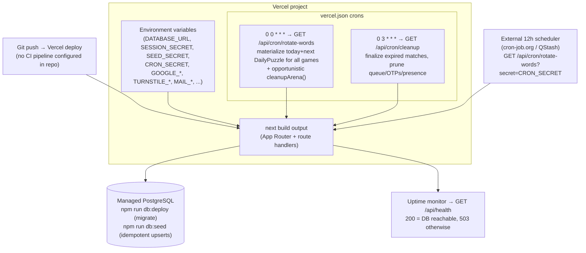

**Deployment facts:**

- `vercel.json` contains **only** the two `crons` entries — no `functions`, `regions`, `rewrites`, or `headers` overrides.
- Cron authentication: `Authorization: Bearer <CRON_SECRET>` (sent automatically by Vercel) or `?secret=<CRON_SECRET>` (`src/lib/cron/auth.ts`).
- IST midnight rollover vs. Vercel Hobby's once-daily limit is why the README recommends an **external** 12-hour scheduler; determinism makes missed runs harmless (row materializes lazily on first read via `resolvePuzzle`).
- Production checklist (README): provision PG → `db:deploy` → `db:seed` → deploy → add external scheduler → change admin password → verify `/api/health` → run `npm run verify:full`.
- Capacity guidance (README): first bottleneck is the Postgres pool, not game code; mitigations already in code = 25s presence heartbeats, 5s online-count cache, indexed hot paths; measure with `npm run loadtest`.

---

## 14. Testing Architecture

### 14.1 Layers

| Layer | Runner | Location | Scope |
|---|---|---|---|
| Unit | Vitest (node env, globals) | `tests/unit/**` (21 files) | Pure logic: buckets, HMAC resolver determinism, feedback, catalog, cron auth, rate limit, HTTP guard, validation, OTP/crypto, reset branching, Google URL building, profile stats, avatar config, arena config/clock/outcome/bot |
| Integration | Vitest + real PostgreSQL | `tests/integration/**` (12 files) | Schema round-trips, Wordle/rotation/resolver/Bee/Connections rules, public & profile queries, full password-reset flow (`MAIL_PROVIDER=file`), Google account linking, arena engine + cleanup |
| E2E | Playwright (Chromium, **production build**) | `tests/e2e/**` (22 specs + helpers + teardown) | Full UI: auth, admin, all games, arena duels, reset, profile/leaderboard, avatar, SEO, cron, console-error sweep, axe WCAG 2.1 A/AA |

### 14.2 Diagram: *Wordle Arena — Development, Verification & Deploy Workflow*

**What it represents:** The actual engineering workflow in the repository. **There are no CI/CD pipeline files** (no `.github/workflows`, no GitLab/Circle/Jenkins configs) — verification is local via npm scripts; deployment is Vercel's git integration (or CLI). Playwright is CI-*aware* (`process.env.CI`) but nothing in-repo invokes it automatically.

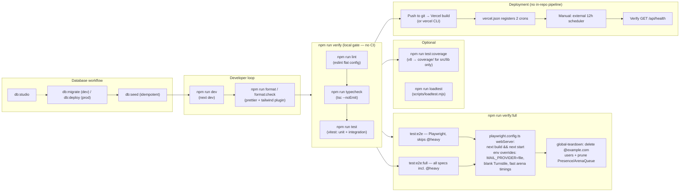

### 14.3 Notable test-architecture decisions

- **Coverage intentionally scoped to `src/lib`** (`vitest.config.mts` include) — pages/components are exercised by Playwright instead; README explains request-scoped code (actions, DAL) is E2E-tested.
- **E2E runs against a production build** (`webServer: npm run build && npm run start`), `workers: 1` (serial, shared DB mutations), `retries: 1` in CI.
- **`@heavy` tag** splits fast inner-loop E2E from slow sweeps (theme/avatar/responsive, full reset replay, full admin suites, full arena duels).
- **Test isolation:** `src/test/setup.ts` swaps `DATABASE_URL` → `TEST_DATABASE_URL`; Playwright `webServer.env` relaxes rate limits, forces mail to file provider, blanks Turnstile keys, and shortens arena timings; teardown removes `@example.com` accounts each run.
- **A11y:** `@axe-core/playwright` checks in `a11y.spec.ts`.
- Playwright is CI-aware but **no pipeline exists in the repository** — document this rather than implying automated CI.

---

## 15. CI/CD

**Finding: there is no CI/CD configuration in this repository.** Globs for `.github/**`, `.gitlab-ci.yml`, and other common pipeline files return nothing. The practical delivery pipeline is:

1. **Local verification:** `npm run verify` (lint + typecheck + unit/integration) and `npm run verify:full` (adds full Playwright suite) — prescribed by README as the pre-release gate.
2. **Deployment:** Vercel git integration (implied by `vercel.json`, `.gitignore` `.vercel` entry, production checklist) or Vercel CLI; crons auto-register on deploy.
3. **Post-deploy:** apply migrations (`db:deploy`), seed if needed, configure external 12-hour scheduler, check `/api/health`.

If CI is added later, the natural jobs are exactly the existing scripts: `lint`, `typecheck`, `test` (with `TEST_DATABASE_URL` service container), `test:e2e`/`test:e2e:full` (with the env overrides already declared in `playwright.config.ts`). See diagram 14 in §14.2 for the workflow as it exists today.

---

## 16. Important Design Decisions

| Decision | Rationale / evidence |
|---|---|
| **Worker-free arena clock** | Phase/round derived from `startedAt` + durations (`src/lib/arena/clock.ts`); any request reconstructs state after crashes; bots advanced lazily on read; guesses idempotent via `(playerId, round)` unique. README “How it stays worker-free”. |
| **Polling + heartbeats instead of WebSockets** | Adaptive match polling (0.9–1.4s), 1.2s queue poll, 5s/25s heartbeats; smooth countdown drawn locally from server timestamps. No socket/SSE code exists. |
| **Deterministic HMAC word resolution** | `HMAC(SEED_SECRET, gameId:bucketKey)` → index; site works even if cron never runs; admin `MANUAL` overrides always win. |
| **Server-computed feedback + answer hiding** | `evaluateGuess` server-side; `answer` only appears in views when completed; README architecture notes state APIs are safe to call directly. |
| **Custom auth (no library)** | Opaque tokens SHA-256-hashed at rest, bcrypt cost 12, PKCE Google flow, HMAC OTPs/tickets — all in `src/lib/auth`, ~15 focused modules with dedicated unit/integration/E2E tests. |
| **Guest-first identity** | `ew_guest` cookie via proxy, zero-DB bootstrap; `migrateGuestToUser` re-homes results on sign-in so play is optional. |
| **Server Actions for forms, REST for hot loops** | Auth/admin/avatar/consent use `useActionState`; games/arena use fetch for fine-grained JSON control and rate limits. |
| **Edge proxy is optimistic only** | `src/proxy.ts` never hits the DB; real authorization in DAL (`requireAdmin`) — defense in depth without edge DB latency. |
| **In-process rate limiting with documented swap seam** | Single-instance correct today; code comment + README direct multi-instance deploys to Redis/Upstash replacement of `rate-limit.ts`. |
| **Pluggable mailer** | `console` (default/dev), `file` (E2E outbox), `resend` (prod) — keeps tests offline and local dev credential-free. |
| **Turnstile bypass when keys absent** | `{ok:true, skipped:true}` — local and Playwright runs need no captcha account; prod enforces when keys set. |
| **IST bucket keys** | Target audience timezone; fixed +330 minutes, no DST handling complexity (`src/lib/time/buckets.ts`). |
| **Alembic-free admin audit** | Every admin mutation writes `AdminAuditLog` — compliance/forensics without external tooling. |
| **`ArenaMode.TRIO` / `rematchOfId` defined but unused** | Schema forward-compatibility; rematch flow currently just re-queues. Documented as latent (see §19). |

---

## 17. External Services

| Service | Purpose | Integration point | Config |
|---|---|---|---|
| **Google Identity / OAuth 2.0** | “Continue with Google” sign-in | `GET /api/auth/google/start` → Google → `GET .../callback`; `src/lib/auth/google*.ts` | `GOOGLE_CLIENT_ID`, `GOOGLE_CLIENT_SECRET`, `GOOGLE_REDIRECT_URI` (button hidden if unset) |
| **Cloudflare Turnstile** | Bot protection on password reset | Client `turnstile-widget.tsx`; server `src/lib/captcha/turnstile.ts` → `challenges.cloudflare.com/turnstile/v0/siteverify` | `NEXT_PUBLIC_TURNSTILE_SITE_KEY`, `TURNSTILE_SECRET_KEY` (bypass if unset) |
| **Resend** | Transactional email (reset OTP) | `src/lib/mail/mailer.ts` → `POST https://api.resend.com/emails` | `MAIL_PROVIDER=resend`, `RESEND_API_KEY`, `MAIL_FROM` (alternatives: `console`, `file`) |
| **PostgreSQL** | System of record | Prisma 7 + `@prisma/adapter-pg` (`src/lib/prisma.ts`, `src/lib/db.ts`) | `DATABASE_URL`, `TEST_DATABASE_URL` |
| **Vercel platform** | Hosting, git deploys, Cron | `vercel.json` crons; serverless function execution | Project env vars |
| **(Optional) external scheduler** | 12-hour word rotation on Hobby plan | Hits `/api/cron/rotate-words?secret=...` | `CRON_SECRET` |
| **Google Fonts (Geist)** | Typography | `next/font/google` in `src/app/layout.tsx` | — (bundled at build) |

No other third-party APIs are called from application code (no analytics SDK, no Redis, no queue providers).

---

## 18. Environment Variables / Configuration

Names only (values never documented). Sources: `.env.example` and `process.env` usage across the repo.

### 18.1 Core application (`.env.example`)

| Variable | Consumers | Purpose |
|---|---|---|
| `DATABASE_URL` | `src/lib/prisma.ts`, `prisma7.config.ts`, teardown | Primary Postgres connection string |
| `TEST_DATABASE_URL` | `src/test/setup.ts`, `tests/integration/*` | Isolated test database (overwrites `DATABASE_URL` in tests) |
| `SESSION_SECRET` | `src/lib/auth/otp.ts` | HMAC key for OTP hashes + reset tickets (dev fallback exists — replace in prod) |
| `SEED_SECRET` | `src/lib/words/resolver.ts`, `rotation.ts` | HMAC key for deterministic daily words + pool rotation seeds |
| `CRON_SECRET` | `src/lib/cron/auth.ts`, cron routes, E2E | Bearer/`?secret` auth for cron endpoints |
| `ADMIN_EMAIL` / `ADMIN_PASSWORD` / `ADMIN_NAME` | `prisma/seed.ts`, E2E helpers | Admin bootstrap during seed |
| `AUTH_RATE_LIMIT` | `src/lib/auth/throttle.ts` | Auth attempts per window (default 30) |
| `NEXT_PUBLIC_SITE_URL` | layout metadata, sitemap, robots, Google redirect default, JSON-LD | Public base URL |
| `GOOGLE_CLIENT_ID` / `GOOGLE_CLIENT_SECRET` / `GOOGLE_REDIRECT_URI` | `src/lib/auth/google.ts` | OAuth app credentials (redirect optional) |
| `MAIL_PROVIDER` / `MAIL_FROM` / `RESEND_API_KEY` | `src/lib/mail/mailer.ts` | `console` \| `file` \| `resend`; From address; Resend key |
| `NEXT_PUBLIC_TURNSTILE_SITE_KEY` / `TURNSTILE_SECRET_KEY` | `src/lib/captcha/turnstile.ts` | Turnstile pair (blank = bypass) |
| `RESET_REQUESTS_PER_EMAIL_PER_HOUR` | `src/lib/auth/password-reset.ts` | Per-email OTP request cap (default 3) |
| `RESET_REQUESTS_PER_IP_PER_HOUR` | `src/lib/auth/password-reset.ts` | Per-IP OTP request cap (default 30) |
| `ARENA_ROUND_MS` / `ARENA_BREAK_MS` / `ARENA_COUNTDOWN_MS` / `ARENA_ROUND_COUNT` | `src/lib/arena/config.ts` | Arena timing overrides (defaults 12000/5000/3000/6) |

### 18.2 Runtime / tooling (used in code, not in `.env.example`)

| Variable | Where | Purpose |
|---|---|---|
| `NODE_ENV` | session/proxy/consent/db cookie `secure` flags | Environment mode |
| `MAIL_TEST_MODE` | `mailer.ts` (`=== "1"`) | Test mail mode flag |
| `OUTBOX_PATH` | `mailer.ts` file provider | Outbox file location (default `.mail-outbox.log`) |
| `PORT` / `PLAYWRIGHT_BASE_URL` / `CI` | `playwright.config.ts` | Test server addressing & CI behavior |

### 18.3 Code-level (non-env) configuration

- Arena timings/points/leagues: `src/lib/arena/config.ts` defaults; `SiteSetting` keys `arena.timings`, `arena.points`, `arena.leagues` for admin display.
- Game rules: `Game.settings` JSON (`resolver`, `rotation`, `answerLength`, `maxAttempts`, `maxMistakes`, …) seeded from `src/lib/games/catalog.ts` (`GAME_CATALOG`).
- Security headers: static in `next.config.ts`.
- Path alias: `@/* → ./src/*` (single alias; Vitest resolves it too).

---

## 19. Future Extension Points

Seams that **already exist in the codebase** (not speculative roadmap items):

1. **Distributed rate limiting / presence** — replace `src/lib/http/rate-limit.ts` in-process `Map` with Redis/Upstash before multi-instance deploys (explicit code comment + README). Presence cache (`arena/presence.ts`) is the second in-process structure to externalize.
2. **12-hour rotation automation** — deterministic resolver already supports it; only an external scheduler (README: cron-job.org / QStash) is needed on Vercel Hobby (1 cron/day limit).
3. **Rematch linkage** — `ArenaMatch.rematchOfId` exists in the schema but the current rematch UX simply re-queues; wiring it would enable rematch history/head-to-head continuity.
4. **TRIO arena mode** — `ArenaMode` enum includes `TRIO`; engine/UI currently implement `DUEL` only (`ArenaPlayer.slot` 1|2). Extending `pairQueue` + `clock` reveal rules would unlock it.
5. **12-hour cron on paid plans** — second Vercel cron entry can be added to `vercel.json` when plan limits allow, replacing the external scheduler.
6. **New solo games** — add a row to `GAME_CATALOG` + a `Game.settings` contract + `src/lib/games/<slug>.ts` + board component + `/api/games/<slug>/{start,guess}`; catalog pages, admin toggle, and analytics pick it up automatically.
7. **Coverage of UI in unit tests** — coverage is deliberately limited to `src/lib`; component-level tests could be added to Vitest later without changing the E2E strategy.
8. **CI pipeline** — no workflow files exist; jobs would map 1:1 onto existing scripts (`verify`, `test:e2e`) with `TEST_DATABASE_URL` and the Playwright env overrides already specified.
9. **Admin-driven league/point tuning** — `SiteSetting` already stores arena leagues/points/timings; an admin editor would only need CRUD against existing keys.
10. **Mailer providers** — `Mailer` interface in `src/lib/mail/mailer.ts` makes adding SES/Postmark a single factory branch.

---

*Document generated from source inspection of the repository (Prisma schema, `src/app`, `src/lib`, tests, and configuration files). Diagrams use Mermaid and reference real file paths and identifiers from the codebase.*
