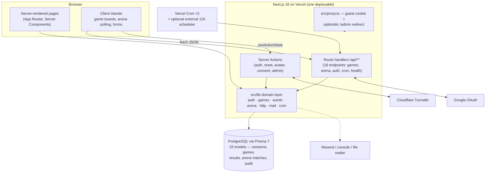

# Wordle Arena — Project Architecture Overview

A concise orientation for engineers new to this repository. For the full reference (all diagrams, env vars, design decisions), see **[`ARCHITECTURE.md`](./ARCHITECTURE.md)**.

---

## What the product is

**Wordle Arena** is a multi-game daily word-puzzle site built as a single **Next.js 16** application:

- **Solo games** — Wordle (daily + unlimited), Connections, Spelling Bee. Answers and color feedback are computed **server-side**; the browser never sees the answer until the game ends.
- **Wordle Arena** — a real-time-feeling **1v1 duel**: two players race the same word on a shared clock (default 6 rounds × [12s play + 5s reveal]). If no human is queued, a deterministic **bot** (Byte et al.) fills in. Signed-in players earn **rank points** across Bronze→Diamond leagues; guest matches are casual.
- **Accounts are optional** — a guest cookie is enough to play; signing in unlocks history, stats, leaderboard, and rank. Login is email/password (bcrypt) or **Google OAuth + PKCE**.
- **Admin dashboard** — users, games, word schedule, word lists (CSV import), live arena, analytics, and an audit log.
- **Word rotation** — daily words are chosen **deterministically** per IST calendar bucket via HMAC, with admin manual overrides that always win; a cron pre-materializes tomorrow’s word but is never required for correctness.

---

## The system in one picture



---

## How a request flows

1. **Edge** — `src/proxy.ts` (Next 16’s middleware replacement) ensures every visitor has an `ew_guest` cookie and optimistically redirects `/admin` hits without a session cookie. It never touches the database and never runs for `/api/*`.
2. **Pages** — async Server Components import domain modules from `src/lib` directly (no HTTP hop) and render HTML, passing serializable **view objects** (`WordleView`, `ArenaState`, …) into client islands.
3. **Mutations** — two planes:
   - **REST** (`fetch`) for hot loops: game start/guess, arena queue/match/presence. Every handler runs `guardRequest` (same-origin check + per-IP sliding-window rate limit) then resolves identity.
   - **Server Actions** for forms: login/signup, password reset, avatar, consent, all admin mutations (guarded by `requireAdmin()` + written to the audit log).
4. **Data access** — the DAL (`src/lib/auth/dal.ts`) validates the opaque session token (SHA-256-hashed at rest in the `ew_session` HTTP-only cookie) on every authenticated operation. Prisma talks to PostgreSQL through the `pg` driver adapter.

---

## The two hardest concepts (worth 5 minutes)

### 1. Deterministic word selection (no scheduler required)

```
IST bucket key (YYYY-MM-DD)  →  HMAC-SHA256(SEED_SECRET, gameId:bucketKey)
                             →  index into ordered answer pool
                             →  DailyPuzzle row (idempotent, MANUAL overrides win)
```

Cron (`GET /api/cron/rotate-words`, authenticated by `CRON_SECRET`) only *pre-materializes* today’s and tomorrow’s rows — a missed run degrades nothing because the first visitor’s request computes the same word.

### 2. Worker-free arena (“realtime” without sockets or background jobs)

- Match phase/round is **derived from timestamps**: `matchClock(startedAt, now)` → `countdown → play ⇄ reveal × 6 → finished`. Any request can reconstruct the state after a crash.
- Clients **poll** (`GET /api/arena/match/[id]` every 0.9–1.4s) and send **heartbeats** (5s); the countdown is drawn locally against server timestamps.
- **Bots advance lazily** on every state read using pure, deterministic functions keyed by `(matchId, round)` — idempotent, no queue workers.
- Pairing uses a single Postgres transaction with `FOR UPDATE SKIP LOCKED`; one guess per round is enforced by a unique constraint `(playerId, round)`.
- Winner: earliest solve → else closest guess (greens, yellows, earlier submission) → draw; forfeit on 20s silence or leave. Finalization settles rank points in one transaction.

---

## Where things live

| Path | Role |
|---|---|
| `src/app/(site)/…` | Public pages (games, arena, auth, profile, legal) |
| `src/app/admin/…` | Admin dashboard (layout enforces `requireAdmin()`) |
| `src/app/api/…` | 18 REST route handlers (games, arena, google, cron, health, presence) |
| `src/proxy.ts` | Next 16 edge proxy: guest cookie + optimistic admin redirect |
| `src/lib/auth/…` | Custom auth: sessions, bcrypt, OTP/reset, Google PKCE, DAL, throttling |
| `src/lib/games/…` + `src/lib/words/…` | Game rules, view DTOs, HMAC resolver, IST buckets, feedback |
| `src/lib/arena/…` | Matchmaking engine, clock, bots, presence, cleanup, scoring |
| `src/lib/http/…` | Origin guard, in-process rate limiter |
| `src/components/…` | UI incl. all `"use client"` islands (boards, arena stage, forms) |
| `prisma/` | Schema (19 models), migrations, seed, word data files |
| `tests/unit · integration · e2e` | Vitest (21+12) and Playwright (22 specs; `@heavy` split) |
| `vercel.json` | Two crons: word rotation (00:00 UTC) + cleanup (03:00 UTC) |

---

## Deliberate “missing” pieces (by design)

| Not present | What exists instead |
|---|---|
| WebSockets / SSE | Adaptive HTTP polling + heartbeats |
| Background workers | Timestamp-derived clock + lazy bot advancement + cron cleanup |
| Redis | In-process rate-limit map & presence cache (documented swap seam in `src/lib/http/rate-limit.ts`) |
| Auth library (NextAuth etc.) | Custom session/OAuth/OTP code in `src/lib/auth` with full test coverage |
| CI pipelines (GitHub Actions etc.) | Local gate `npm run verify` / `verify:full`; Vercel git deploys |
| `/api/admin/*` | Admin operations as Server Actions behind `requireAdmin()` |

---

## Suggested reading order for a new engineer

1. This file → skim **§3–§5** of `ARCHITECTURE.md` (system, application, data).
2. `prisma/schema.prisma` — the 19 models are the source of truth for every feature.
3. `src/lib/auth/dal.ts` + `src/proxy.ts` — how identity and admin gating work.
4. `src/lib/games/wordle.ts` + `src/lib/words/resolver.ts` — the solo-game loop and deterministic words.
5. `src/lib/arena/engine.ts` + `src/lib/arena/clock.ts` — matchmaking and the worker-free match lifecycle.
6. `npm run verify` to establish the local quality gate before changing anything.

**Setup (from README):** `npm install` → `cp .env.example .env` → `npm run db:migrate && npm run db:seed` → `npm run dev` (site at `:3000`, admin at `:3000/admin`).
